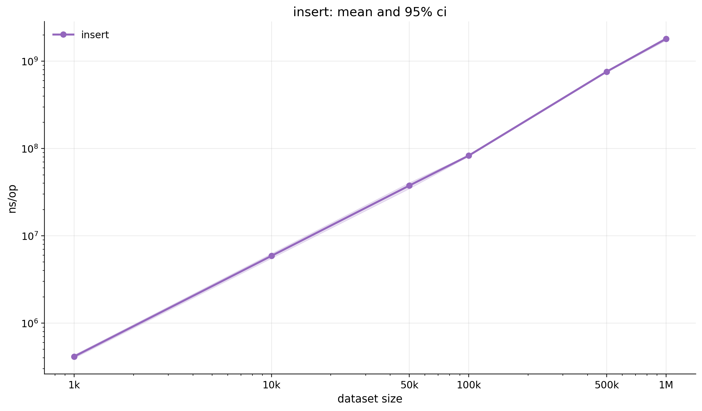
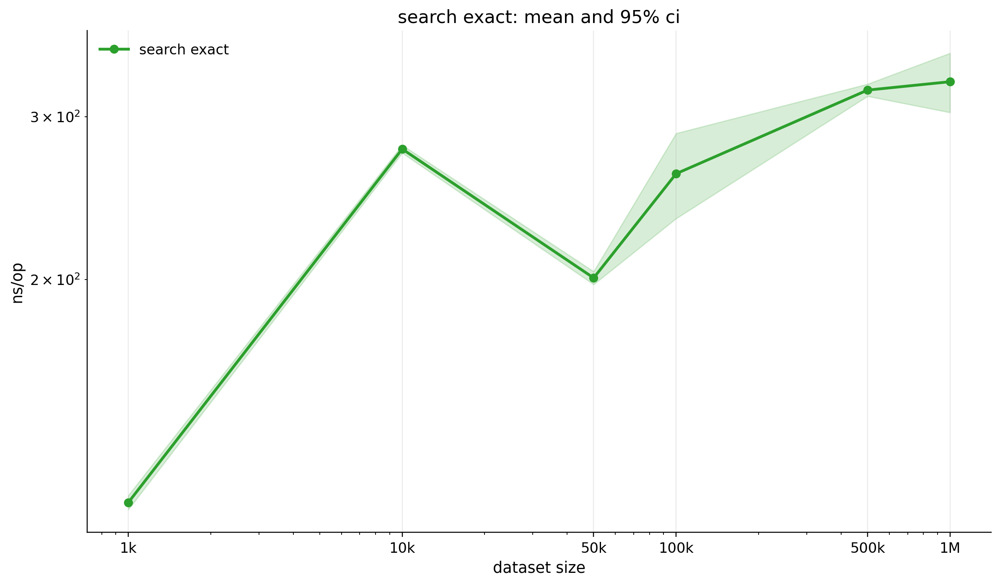
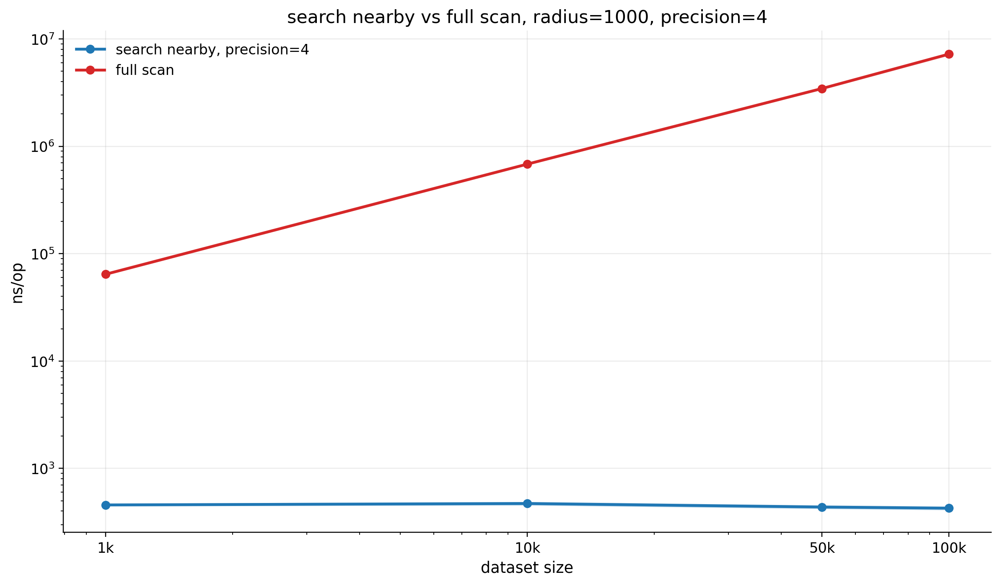
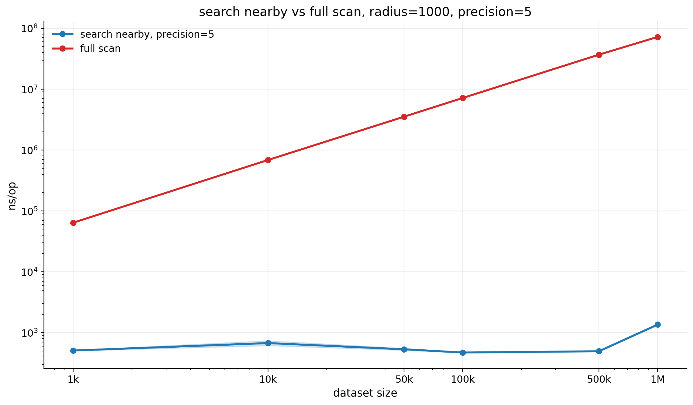
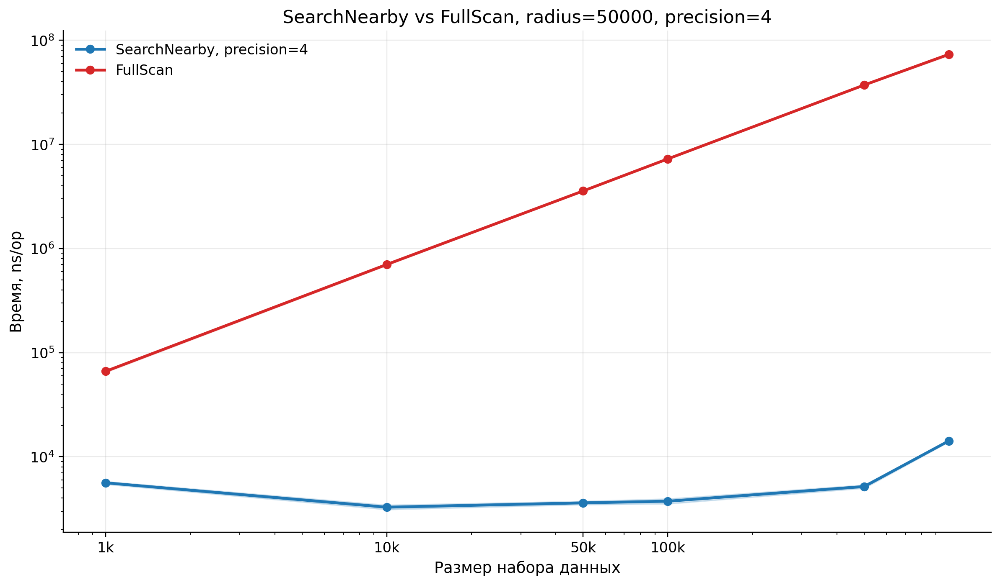
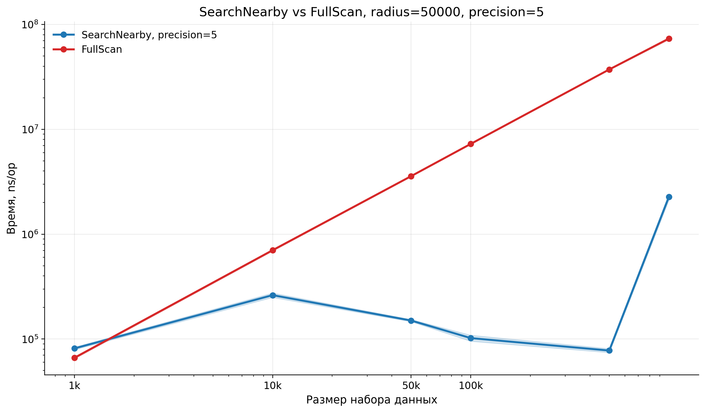
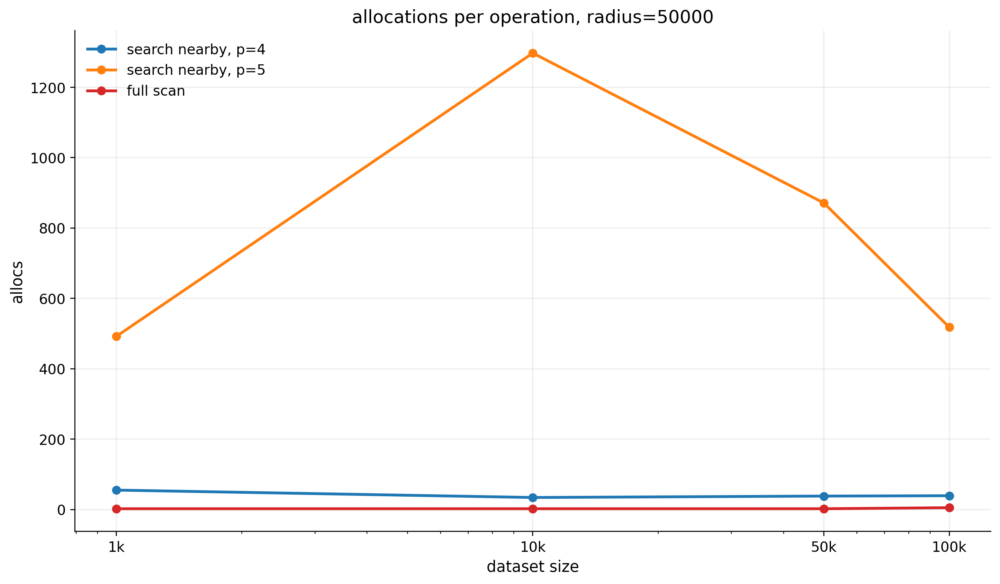
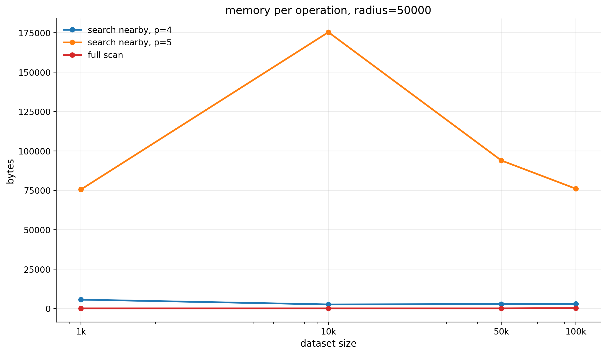
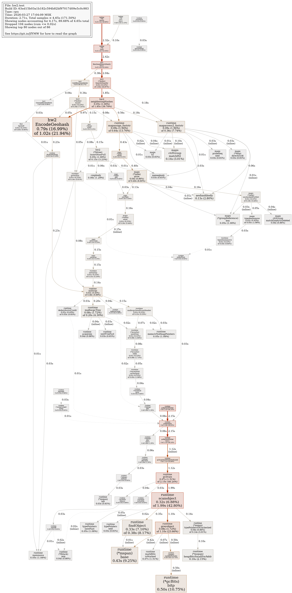
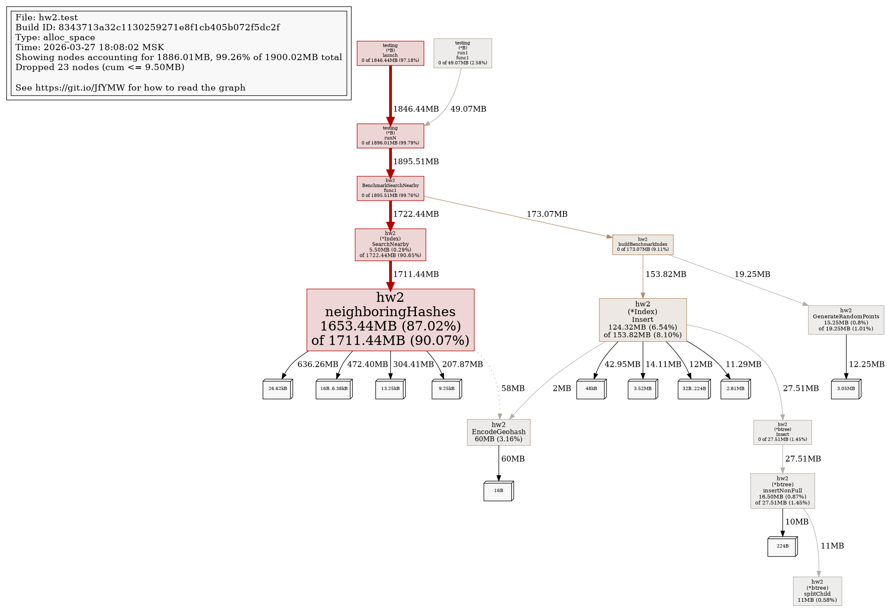

# HW2 - Геопоиск по Lat/Lng

В этой лабораторной я реализовала простой in-memory индекс для геопоиска по координатам `Lat/Lng`.

Смысл решения такой:

- координаты кодируются в `geohash`;
- geohash-ключи хранятся в `B-tree`;
- сами объекты лежат в `map[string][]GeoObject`;
- для проверки корректности есть baseline `FullScan`, который просто делает полный перебор.

То есть индекс здесь нужен для ускорения поиска, а `FullScan` нужен как понятная точка сравнения и для проверки правильности результата.

## Что реализовано

Сейчас в проекте есть:

- `Insert` - добавление объекта в индекс;
- `SearchExact` - точный поиск по координатам;
- `SearchNearby` - поиск объектов в радиусе от точки;
- `FullScan` - baseline без индекса;
- генератор случайных данных;
- функциональные тесты;
- benchmark'и;
- CPU profiling;
- memory profiling;
- сохранение сырых результатов, summary-таблиц и графиков.

## Как устроено решение

Основная логика лежит в `index.go`.

При вставке:

1. координаты объекта переводятся в `geohash`;
2. этот ключ добавляется в `B-tree`;
3. объект кладется в bucket по этому `geohash`;
4. отдельно объект сохраняется в общий срез для `FullScan`.

Точный поиск работает так:

1. для точки запроса строится `geohash`;
2. из индекса берется bucket этой ячейки;
3. дальше внутри bucket остаются только объекты с точно такими же `Lat` и `Lng`.

То есть сейчас `SearchExact` уже не возвращает просто всю geohash-ячейку, а именно делает точное совпадение по координатам.

Nearby-поиск устроен так:

1. вокруг точки строится bounding box;
2. по нему вычисляется набор geohash-ячеек, которые покрывают окно поиска;
3. из индекса вытаскиваются только эти buckets;
4. потом уже идет точная фильтрация по haversine;
5. результат сортируется по расстоянию.

Для расстояния используется haversine, потому что координаты глобальные, и на больших расстояниях обычная евклидова метрика уже не очень подходит.

## Что было сделано по ходу работы

Работа шла примерно так:

1. сначала я собрала базовый каркас: модель объекта, geohash, B-tree, buckets и сам индекс;
2. потом добавила `Insert`, `SearchExact` и `SearchNearby`;
3. после этого сделала `FullScan`, чтобы сравнивать индексный поиск с полным перебором;
4. дальше добавила генератор случайных точек и функциональные тесты;
5. отдельно написала benchmark'и;
6. потом уже разбиралась с производительностью и профилированием.

## Где была основная сложность

Самая неприятная часть была в `SearchNearby`.

Изначально идея была простая: взять центральную geohash-ячейку и соседние. Но на практике на случайных тестах быстро появились расхождения с `FullScan`.

Проблемы были в таких местах:

- точки терялись на границах geohash-ячеек;
- появлялись сложные случаи около `-180/180` по долготе;
- большие радиусы запроса уже не укладывались в маленький набор соседних ячеек;
- около полюсов оценка охвата по долготе ведет себя не очень стабильно.

Из-за этого nearby-поиск пришлось сделать аккуратнее:

- сначала строится окно поиска;
- потом вычисляется набор geohash-ячеек, который это окно покрывает;
- потом берутся кандидаты только из этих ячеек;
- и уже после этого делается точная проверка по реальному расстоянию.

Это не самая агрессивная оптимизация, но зато такой вариант дает корректный результат и нормально сравнивается с baseline.

## Что проверяется тестами

В проекте есть:

- случайные тесты, где `SearchNearby` сравнивается с `FullScan`;
- corner cases: пустой индекс, одна точка, одинаковые координаты;
- проверка граничных значений `lat/lng`;
- проверка невалидных значений;
- проверка точного поиска по координатам;
- проверка невалидного радиуса для nearby-поиска.

Локальная команда:

```bash
env GOCACHE=/tmp/go-build-hw2 go test ./...
```

## Бенчмарки

Бенчмарки лежат в `benchmark_test.go`.

Сейчас замеряются:

- `Insert`
- `SearchExact`
- `SearchNearby`
- `FullScan`

Размеры данных:

- `1000`
- `10000`
- `50000`
- `100000`

Для `SearchNearby` отдельно меняются:

- `precision = 4` и `5`
- `radius = 1000` и `50000`

Основные команды:

```bash
make test
make bench
make bench-save
make plot
make flamegraph
make memprofile
```

## Где лежат результаты

После `make bench-save`:

- `artifacts/metrics/raw/bench_run_*.txt` - сырые результаты;
- `artifacts/metrics/raw/*_runs.tsv` - результаты отдельных запусков;
- `artifacts/metrics/summary/*_summary.tsv` - среднее и 95% доверительный интервал.

После построения графиков:

- `../graphs/hw2/*.png`

Профили:

- `artifacts/profiles/search_nearby.cpu.prof`
- `artifacts/profiles/search_nearby.mem.prof`

Картинки профилей:

- `../graphs/hw2/search_nearby_flame.png`
- `../graphs/hw2/search_nearby_mem.png`

## Что получилось по результатам

По результатам видно довольно ожидаемую картину:

- `SearchExact` работает быстро, потому что поиск идет только внутри одного bucket;
- `Insert` растет вместе с числом объектов, что логично;
- `SearchNearby` быстрее `FullScan`, потому что не смотрит на все объекты подряд;
- `FullScan` нужен как baseline, но на больших данных заметно проигрывает;
- `precision` влияет на nearby-поиск довольно сильно.

Особенно интересный момент был с `precision`.

Гипотеза здесь такая:

- если `precision` слишком маленький, ячейки крупные, и в кандидаты может попадать слишком много лишних объектов;
- если `precision` слишком большой, ячейки мелкие, и nearby-поиску приходится обходить уже слишком много соседних ячеек;
- поэтому где-то посередине появляется более удачный баланс.

По текущим замерам как раз видно, что `precision=4` во многих случаях ведет себя практичнее, чем `precision=5`.

## Что уже было оптимизировано

По ходу работы nearby-поиск уже был улучшен по сравнению с самым простым вариантом.

Изначально можно было бы идти либо вообще по всем объектам, либо по слишком широкому набору ячеек. Сейчас сделано лучше:

- nearby-поиск не делает полный перебор;
- он сначала сужает область до нужных geohash-ячеек;
- только потом считает точное расстояние;
- итоговая фильтрация остается точной, поэтому корректность не теряется.

То есть основная оптимизация уже в том, что поиск кандидатов идет не по всему индексу, а только по тем ячейкам, которые реально могут пересекаться с окном запроса.

## Гипотезы по узким местам

Если смотреть на поведение кода и на профили, то основные узкие места, скорее всего, такие:

- в `SearchNearby` создается много временных срезов и промежуточных кандидатов;
- при большом `precision` растет число geohash-ячеек, которые приходится обходить;
- на больших радиусах nearby-поиск начинает тратить больше времени не на саму структуру, а на количество кандидатов и финальную фильтрацию;
- часть времени уходит на вычисление расстояния для каждого кандидата;
- часть памяти уходит на сбор временного списка объектов перед фильтрацией.

## Что можно было бы улучшить дальше

Если продолжать оптимизировать решение, то дальше я бы смотрела в такие вещи:

1. уменьшить число аллокаций в `SearchNearby`;
2. переиспользовать буферы для кандидатов и результатов;
3. попробовать делать более узкий отбор geohash-ячеек;
4. отдельно посмотреть, можно ли сокращать число вычислений haversine;
5. сравнить это решение не только с `FullScan`, но и с другой структурой индекса.

Еще одна нормальная гипотеза на будущее такая: если nearby-поиск будет вызываться очень часто, имеет смысл думать не только про скорость поиска, но и про более компактное хранение buckets.

## Графики

### Insert



### SearchExact



### SearchNearby vs FullScan, radius=1000, precision=4



### SearchNearby vs FullScan, radius=1000, precision=5



### SearchNearby vs FullScan, radius=50000, precision=4



### SearchNearby vs FullScan, radius=50000, precision=5



### Allocations



### Memory



### CPU Profile



### Memory Profile



## Итог

В итоге получилась рабочая лабораторная с:

- индексом для геопоиска по `Lat/Lng`;
- точным поиском;
- nearby-поиском;
- baseline в виде полного перебора;
- функциональными тестами;
- benchmark'ами;
- CPU profiling;
- memory profiling;
- сохраненными артефактами и графиками.

Главная идея этой работы была не в том, чтобы сделать какой-то идеальный промышленный геопоиск, а в том, чтобы собрать понятную реализацию, проверить ее тестами и посмотреть, как она ведет себя по времени и памяти. В текущем состоянии это уже можно нормально показывать и обсуждать на защите.
