# HW1 - Hashing Algorithms

Выполнила Дусаева Элина.

В работе реализованы три структуры:

- `extendible hashing` на файловой системе;
- `perfect hash`;
- `LSH` для точек в `3D`.

## Конфигурация ПК

Все замеры и профилирование в этой работе снимались на следующей машине:

- ОС: `Ubuntu 24.04`, ядро `Linux 6.17.0-19-generic`
- Процессор: `13th Gen Intel(R) Core(TM) i5-13400F`
- Ядер: `10`
- Потоков: `16`
- Частота CPU: до `4.6 GHz`
- L3 cache: `20 MiB`
- Оперативная память: `31 GiB`
- Swap: `8 GiB`

### Как снимались замеры

Пайплайн для hw1 устроен так:

1. сначала делается warmup
2. затем запускается несколько независимых прогонов
3. каждый прогон сохраняется отдельно
4. после того считаются summary-таблицы

Основные команды:

```bash
cd hw1
make test
make metrics ALGO=extendible BENCH_RUNS=5 BENCH_TIME=3x WARMUP_TIME=1x WARMUP_SIZES=10000,50000 SIZES=10000,50000,100000
make metrics ALGO=perfect BENCH_RUNS=5 BENCH_TIME=3x WARMUP_TIME=1x WARMUP_SIZES=10000,100000 SIZES=10000,100000,500000,1000000
make metrics ALGO=lsh BENCH_RUNS=5 BENCH_TIME=3x WARMUP_TIME=1x WARMUP_SIZES=10000,100000 SIZES=10000,100000,500000,1000000
make profile ALGO=extendible PROFILE_SIZE=100000 BENCH_TIME=3x
make profile ALGO=perfect PROFILE_SIZE=100000 BENCH_TIME=3x
make profile ALGO=lsh PROFILE_SIZE=100000 BENCH_TIME=3x
make cpu-web ALGO=extendible PROFILE_SIZE=100000 CPU_PPROF_HTTP=:8089
make mem-web ALGO=extendible PROFILE_SIZE=100000 MEM_PPROF_HTTP=:8090
make cpu-web ALGO=perfect PROFILE_SIZE=100000 CPU_PPROF_HTTP=:8091
make mem-web ALGO=perfect PROFILE_SIZE=100000 MEM_PPROF_HTTP=:8092
make cpu-web ALGO=lsh PROFILE_SIZE=100000 CPU_PPROF_HTTP=:8093
make mem-web ALGO=lsh PROFILE_SIZE=100000 MEM_PPROF_HTTP=:8094
```

## Что получилось по результатам

В целом по результатам получилась довольно ожидаемая картина:

- extendible hashing сильно страдает от файловой природы реализации, особенно на insert и delete
- perfect hash показывает очень стабильный и быстрый lookup даже на 1e6 ключей
- LSH заметно выигрывает у FullScan, но все равно растет с размером корпуса, потому что увеличивается число кандидатов и стоимость проверки

## Графики и результаты

### Extendible hashing

benchmark'и измеряет полный сценарий работы с набором размера `N`.

- Insert - создается пустая таблица, затем в нее последовательно вставляются все N пар key/value
- Update - сначала в таблицу вставляются N записей, затем для всех этих ключей выполняется обновление значений
- Get - сначала в таблицу вставляются N записей, затем для всех N ключей выполняется поиск
- Delete - сначала в таблицу вставляются N записей, затем все N записей удаляются.

Из-за этого `ns/op` здесь нужно читать как стоимость полного batch-сценария на наборе размера `N`, а не как цену одной отдельной записи.

#### Задержка операций

| size | insert mean ns/op | insert 95% CI | update mean ns/op | update 95% CI | get mean ns/op | get 95% CI | delete mean ns/op | delete 95% CI |
| --- | ---: | ---: | ---: | ---: | ---: | ---: | ---: | ---: |
| 10000 | 699442000 | 294408000 | 483281000 | 65389800 | 129141000 | 2518280 | 1193467073 | 111987000 |
| 50000 | 3330970000 | 262659000 | 2395630000 | 120297000 | 639801000 | 18298600 | 10068600000 | 168800000 |
| 100000 | 7246846103 | 142863000 | 4737630000 | 59916300 | 1267340000 | 9250380 | 33682000000 | 51858700 |

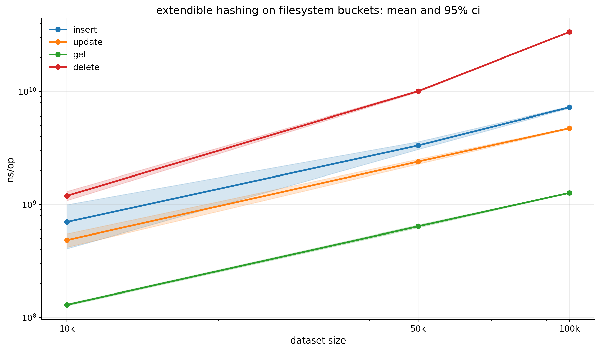

Get оказался самой дешевой операцией, потому что он не меняет структуру таблицы и сводится к вычислению хеша, чтению нужного bucket-а и поиску записи внутри него. 

Update тоже ведет себя относительно стабильно: несмотря на запись на диск, он не требует split/merge bucket-ов и не перестраивает directory. 

Insert же дорожает из-за split bucket-ов и возможного расширения directory.

Delete оказывается самой тяжелой операцией, потому что в моей реализации после удаления дополнительно выполняются merge и shrink, что приводит к большому числу чтений и перезаписей файлов.`

#### Память и аллокации 

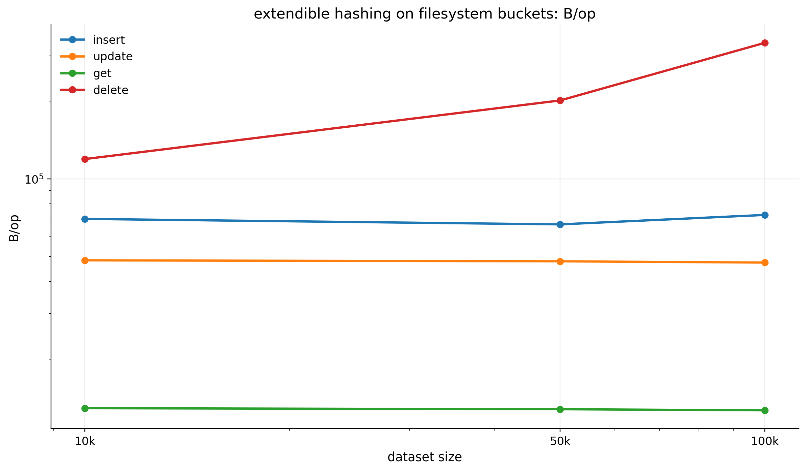

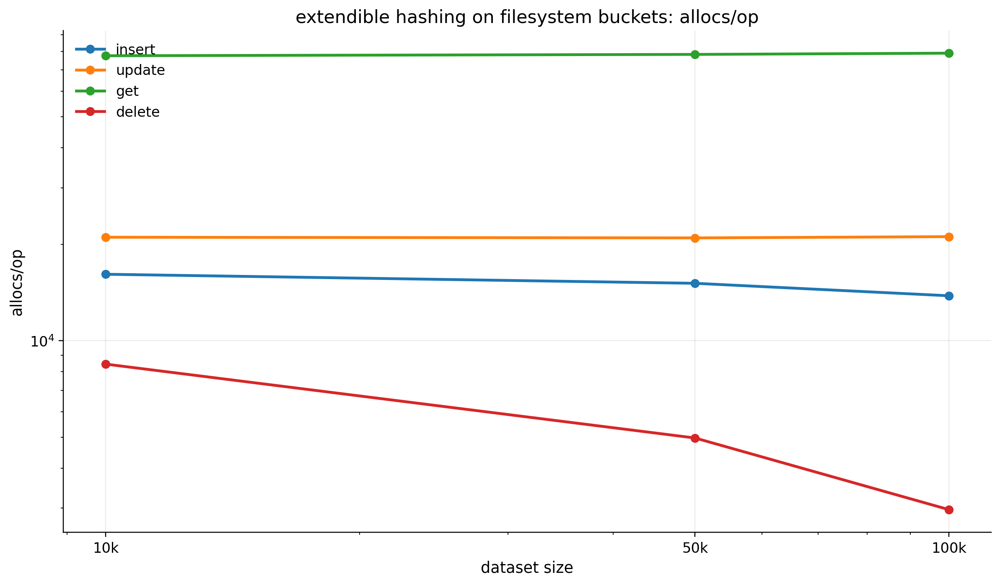

Insert и Update создают много временных объектов во время работы с bucket-ами и файлами, поэтому у них много аллокаций.
Delete после удаления записи может не просто изменить bucket, а еще запустить слияние bucket-ов (merge) и уменьшение directory (shrink), из-за чего приходится дополнительно читать, пересобирать и переписывать структуру.
поэтому Delete получается тяжелым не только по времени, но и по памяти.

#### Профилирование

Профиль снимался с `BenchmarkTableInsert`, потому что именно `Insert` лучше всего показывает цену модификации структуры.

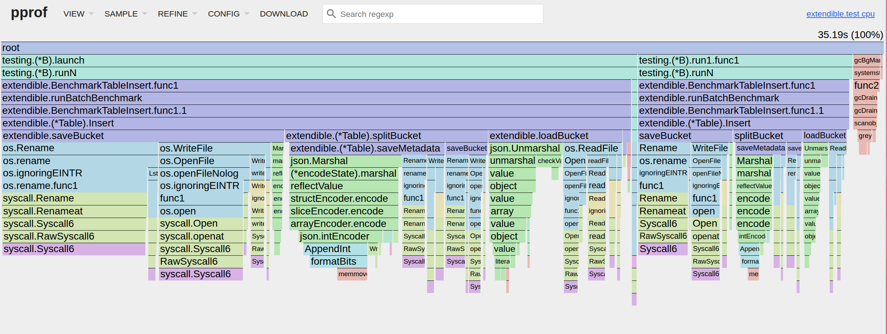

По CPU framegraph видно, что узкое место находится не в одной маленькой функции, а в связке файлового `I/O`, сериализации и переразбиения bucket-ов. Именно это и объясняет, почему `Insert` так быстро дорожает с ростом размера данных.

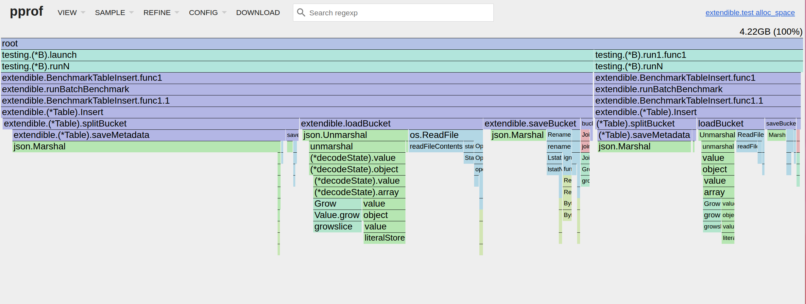

По memory framegraph видно похожую картину: основная стоимость памяти тоже рождается прямо в пути модификации структуры. Поэтому для `extendible hashing` в первую очередь хочется уменьшать число промежуточных аллокаций, повторных чтений metadata и объем перезаписи bucket-ов.

Гипотезы по улучшению:

- уйти с `json` на более компактный бинарный формат;
- буферизовать запись bucket-ов;
- уменьшить число повторных чтений metadata;
- отдельно оптимизировать delete-path.

### Perfect hash

Здесь benchmark'и тоже измеряют полный сценарий на наборе размера N.

- Build - строится вся perfect hash таблица по набору изN ключе
- Get - после построения выполняется полный проход по всем существующим ключам
- GetMiss - после построения выполняется серия запросов по отсутствующим ключам.

| size | build ns/op | build 95% CI | get ns/op | get 95% CI | get miss ns/op | get miss 95% CI |
| --- | ---: | ---: | ---: | ---: | ---: | ---: |
| 10000 | 26722269 | 1469650 | 731676 | 219264 | 384233 | 12192.9 |
| 100000 | 267733000 | 5725960 | 13368300 | 958231 | 10826700 | 3600880 |
| 500000 | 1426000000 | 10520300 | 86399800 | 3401700 | 61348800 | 3949470 |
| 1000000 | 2919651349 | 10795700 | 177855000 | 5425230 | 146660000 | 5581730 |

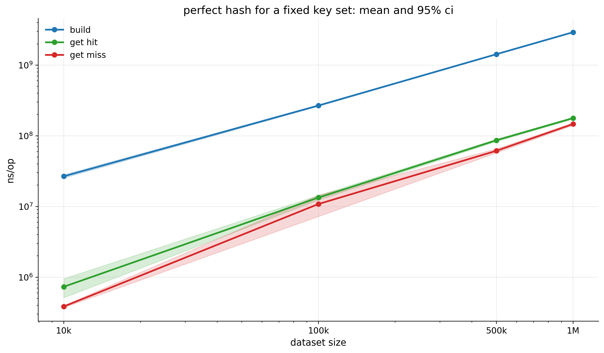

Для perfect hash самая дорогая операция ожидаемо оказалась Build, потому что именно на этом этапе строится вся структура

После построения Get становится очень дешевым и стабильным, потому что доступ к элементу сводится к вычислению индекса и проверке одной позиции. 

#### Память и аллокации 

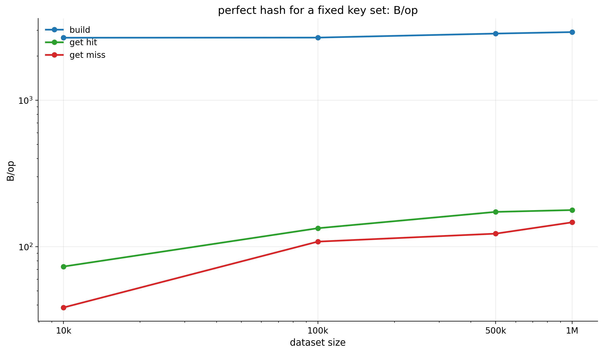

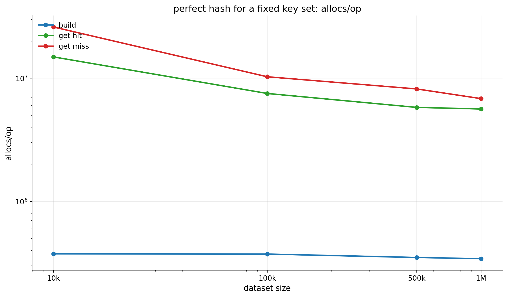

У perfect hash основная память уходит в Build на этом этапе создается вся структура и промежуточные таблицы, тогда как Get почти ничего не аллоцирует.

#### Профилирование

Профиль снимался с `BenchmarkTableBuild`, потому что именно `Build` является главным нетривиальным этапом алгоритма.

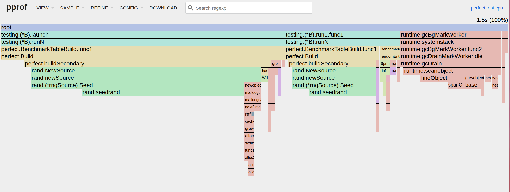

По CPU framegraph видно, что цена построения уходит в распределение по primary bucket-ам, подбор параметров secondary hashing и само построение secondary table без коллизий. Это хорошо согласуется с benchmark'ами, где именно `Build` остается главным дорогим этапом.

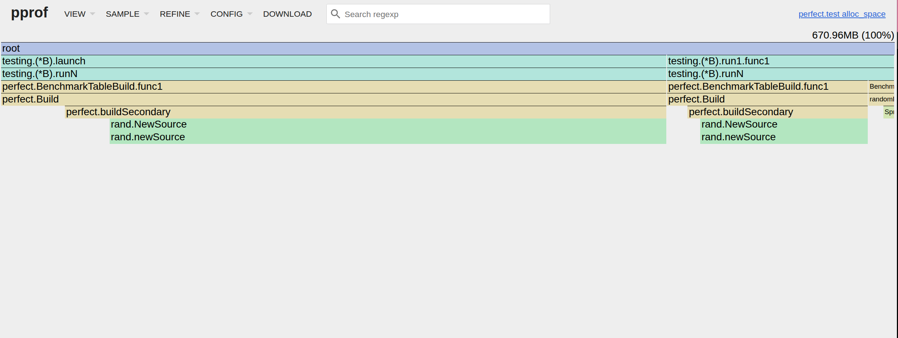

По memory framegraph тоже видно, что основная цена памяти сосредоточена в этапе построения. Lookup здесь почти ничего не стоит по памяти, а вот build требует заметного количества служебных структур.

Гипотезы по улучшению:

- улучшить primary hashing для уменьшения разбаланса bucket-ов;
- уменьшить число попыток при построении secondary table;
- аккуратнее работать с памятью в bucket-ах большого размера.

### LSH

- Build - строится индекс по всему набору из N точек
- Add - создается пустой индекс, после чего в него по одной добавляются все точки
- Search - на уже построенном индексе выполняется серия запросов поиска ближайших точек;
- FullScan - для тех же запросов выполняется baseline без индекса, то есть полный перебор.

| size | build ns/op | build 95% CI | add ns/op | add 95% CI | search ns/op | search 95% CI | full scan ns/op | full scan 95% CI |
| --- | ---: | ---: | ---: | ---: | ---: | ---: | ---: | ---: |
| 10000 | 2994721 | 537416 | 2949900 | 437212 | 9104210 | 448405 | 21219900 | 1926930 |
| 100000 | 30601700 | 3142480 | 32239500 | 4809830 | 217810000 | 6821440 | 615462000 | 20271900 |
| 500000 | 214973000 | 17298800 | 204283000 | 4099180 | 2344810000 | 19465300 | 11156800000 | 184752000 |
| 1000000 | 470677000 | 23689600 | 456007000 | 26534100 | 4986250000 | 56231300 | 24177017103 | 222786000 |

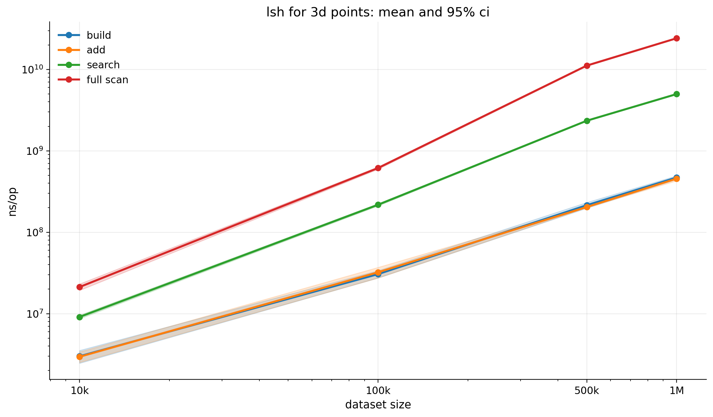

Build и Add растут достаточно ровно, потому что в обоих случаях каждая точка независимо отображается в несколько таблиц и добавляется в соответствующие bucket-ы. 

Search заметно дороже построения одной точки, поскольку поиск требует обхода нескольких соседних ячеек, объединения кандидатов и точной фильтрации по расстоянию. При этом Search все равно существенно лучше FullScan, потому что индекс сокращает число точек, для которых приходится выполнять точную проверку. FullScan остается самым тяжелым baseline, поскольку фактически делает полный перебор и его стоимость быстро растет вместе с размером корпуса.

#### Профилирование

Профиль снимался с `BenchmarkTableSearch`, потому что именно индексный `Search` является главным пользовательским сценарием.

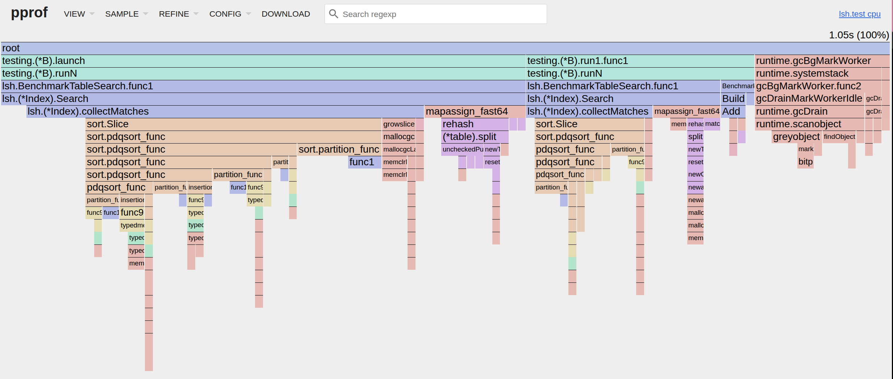

По CPU framegraph видно, что основная цена поиска связана с обходом таблиц и соседних ячеек, сбором кандидатов и последующей точной фильтрацией по расстоянию. То есть узкое место здесь именно в кандидатах, а не только в вычислении самих хешей.

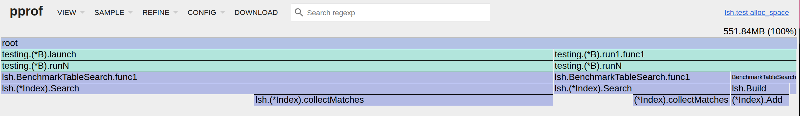

По memory framegraph видно, что стоимость памяти тоже сидит в работе со множеством кандидатов и временными структурами при поиске. Это хорошо объясняет, почему `Search` заметно лучше `FullScan`, но все равно не превращается в “почти бесплатную” операцию.

Гипотезы по улучшению:

- переиспользовать память под множество кандидатов;
- уменьшить число промежуточных аллокаций;
- подобрать параметры сеток и `cell size` под более крупные наборы данных.

## Дополнительные Pprof-картинки

### Extendible hashing

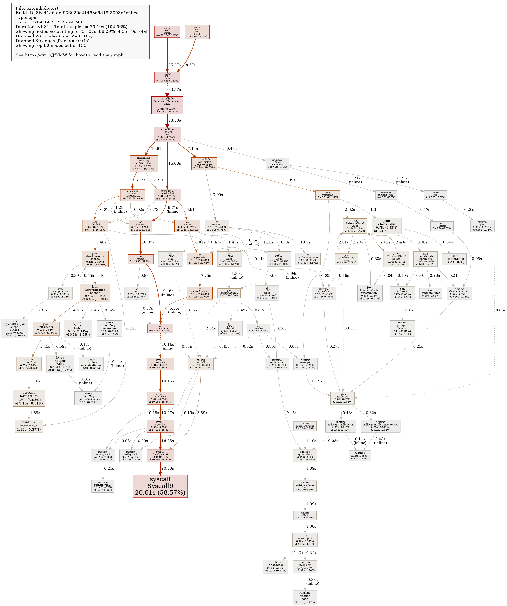

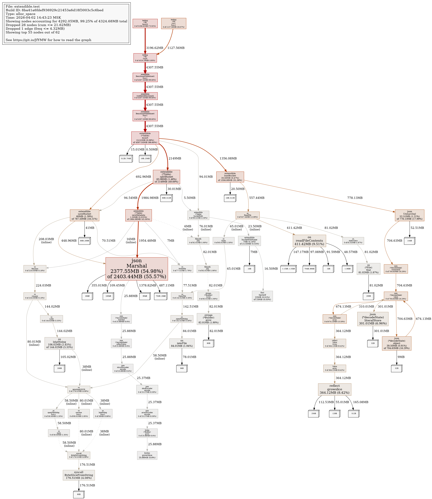

### Perfect hash

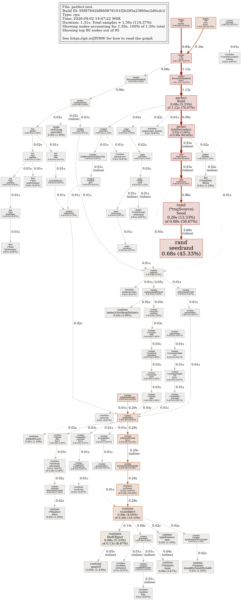

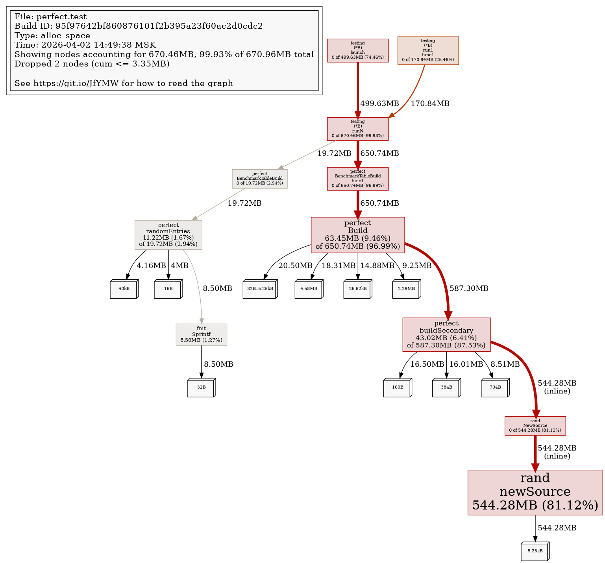

### LSH

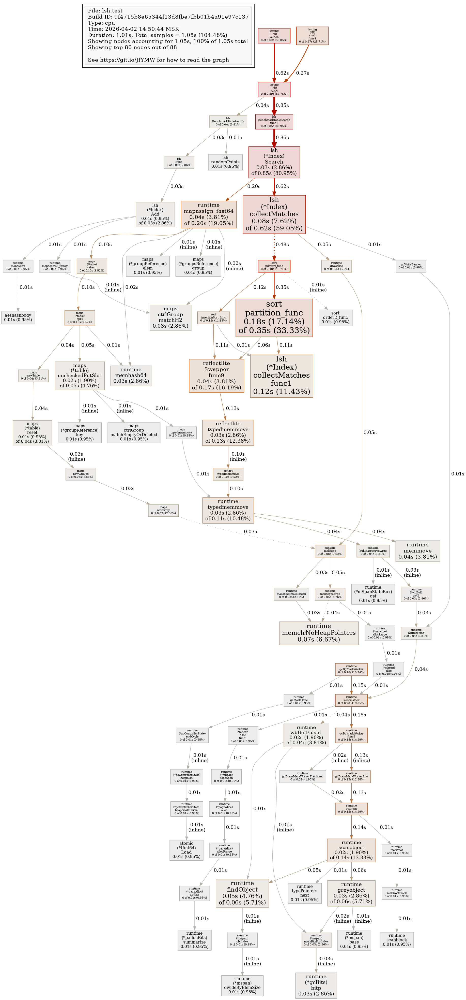

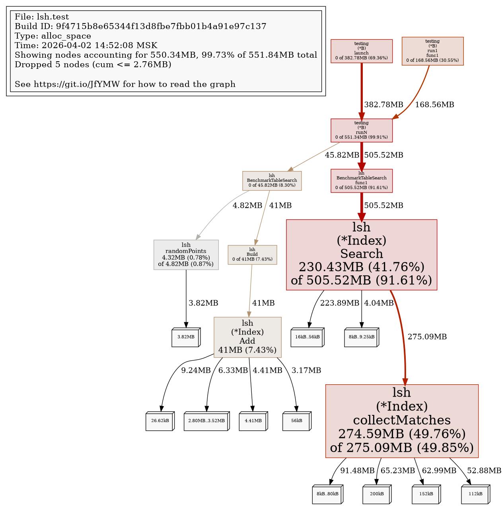
