# HW1 - Hashing Algorithms

Выполнила Дусаева Элина.

В работе реализованы три структуры:

- `extendible hashing` на файловой системе;
- `perfect hash`;
- `LSH` для точек в `3D`.

## Конфигурация ПК

Все замеры и профилирование в этой работе снимались на следующей машине:

- ОС: `Ubuntu 24.04`, ядро `Linux 6.17.0-19-generic`
- Процессор: `13th Gen Intel(R) Core(TM) i5-13400F`
- Ядер: `10`
- Потоков: `16`
- Частота CPU: до `4.6 GHz`
- L3 cache: `20 MiB`
- Оперативная память: `31 GiB`
- Swap: `8 GiB`

### Как снимались замеры

Пайплайн для hw1 устроен так:

1. сначала делается warmup
2. затем запускается несколько независимых прогонов
3. каждый прогон сохраняется отдельно
4. после того считаются summary-таблицы

Основные команды:

```bash
cd hw1
make test
make metrics ALGO=extendible BENCH_RUNS=5 BENCH_TIME=3x WARMUP_TIME=1x WARMUP_SIZES=10000,50000 SIZES=10000,50000,100000
make metrics ALGO=perfect BENCH_RUNS=5 BENCH_TIME=3x WARMUP_TIME=1x WARMUP_SIZES=10000,100000 SIZES=10000,100000,500000,1000000
make metrics ALGO=lsh BENCH_RUNS=5 BENCH_TIME=3x WARMUP_TIME=1x WARMUP_SIZES=10000,100000 SIZES=10000,100000,500000,1000000
make profile ALGO=extendible PROFILE_SIZE=100000 BENCH_TIME=3x
make profile ALGO=perfect PROFILE_SIZE=100000 BENCH_TIME=3x
make profile ALGO=lsh PROFILE_SIZE=100000 BENCH_TIME=3x
make cpu-web ALGO=extendible PROFILE_SIZE=100000 CPU_PPROF_HTTP=:8089
make mem-web ALGO=extendible PROFILE_SIZE=100000 MEM_PPROF_HTTP=:8090
make cpu-web ALGO=perfect PROFILE_SIZE=100000 CPU_PPROF_HTTP=:8091
make mem-web ALGO=perfect PROFILE_SIZE=100000 MEM_PPROF_HTTP=:8092
make cpu-web ALGO=lsh PROFILE_SIZE=100000 CPU_PPROF_HTTP=:8093
make mem-web ALGO=lsh PROFILE_SIZE=100000 MEM_PPROF_HTTP=:8094
```

## Графики и результаты

### Extendible hashing

benchmark'и измеряет полный сценарий работы с набором размера `N`.

- Insert - создается пустая таблица, затем в нее последовательно вставляются все N пар key/value
- Update - сначала в таблицу вставляются N записей, затем для всех этих ключей выполняется обновление значений
- Get - сначала в таблицу вставляются N записей, затем для всех N ключей выполняется поиск
- Delete - сначала в таблицу вставляются N записей, затем все N записей удаляются.

Из-за этого `ns/op` здесь нужно читать как стоимость полного batch-сценария на наборе размера `N`, а не как цену одной отдельной записи.

#### Задержка операций

| size   | insert: ns/item (mean ± CI) | update: ns/item (mean ± CI) | get: ns/item (mean ± CI) | delete: ns/item (mean ± CI) |
| ------ | --------------------------: | --------------------------: | -----------------------: | --------------------------: |
| 10000  |               2864.2 ± 97.3 |               2878.8 ± 93.2 |               98.5 ± 1.5 |                933.8 ± 47.3 |
| 50000  |               3164.4 ± 57.7 |               3128.0 ± 78.0 |              128.7 ± 6.2 |               1435.0 ± 40.6 |
| 100000 |              3345.8 ± 114.1 |               3163.2 ± 63.1 |             195.0 ± 20.1 |               2060.6 ± 48.6 |

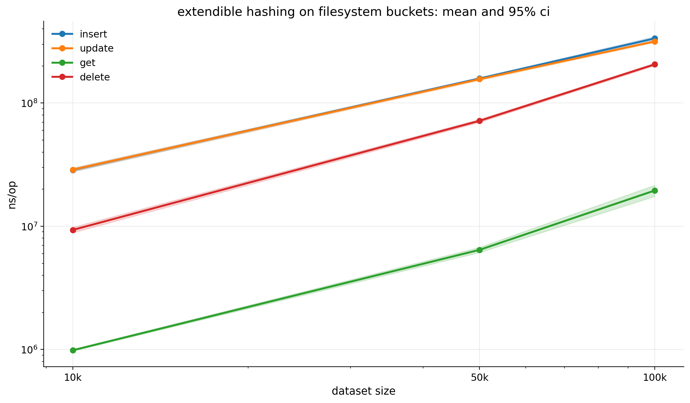

Get оказался самой дешевой операцией, потому что он не меняет структуру таблицы и сводится к вычислению хеша, чтению нужного bucket-а и поиску записи внутри него. 

Update тоже ведет себя относительно стабильно: несмотря на запись на диск, он не требует split/merge bucket-ов и не перестраивает directory. 

Insert же дорожает из-за split bucket-ов и возможного расширения directory.

Delete оказывается самой тяжелой операцией, потому что в моей реализации после удаления дополнительно выполняются merge и shrink, что приводит к большому числу чтений и перезаписей файлов.`

#### Память и аллокации 

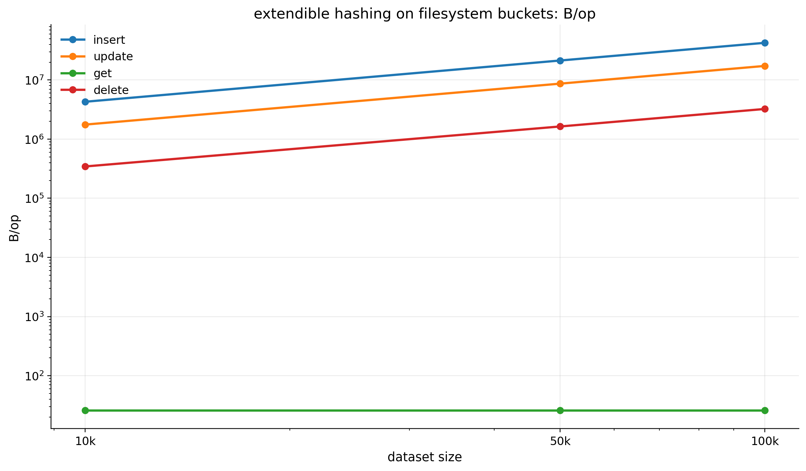

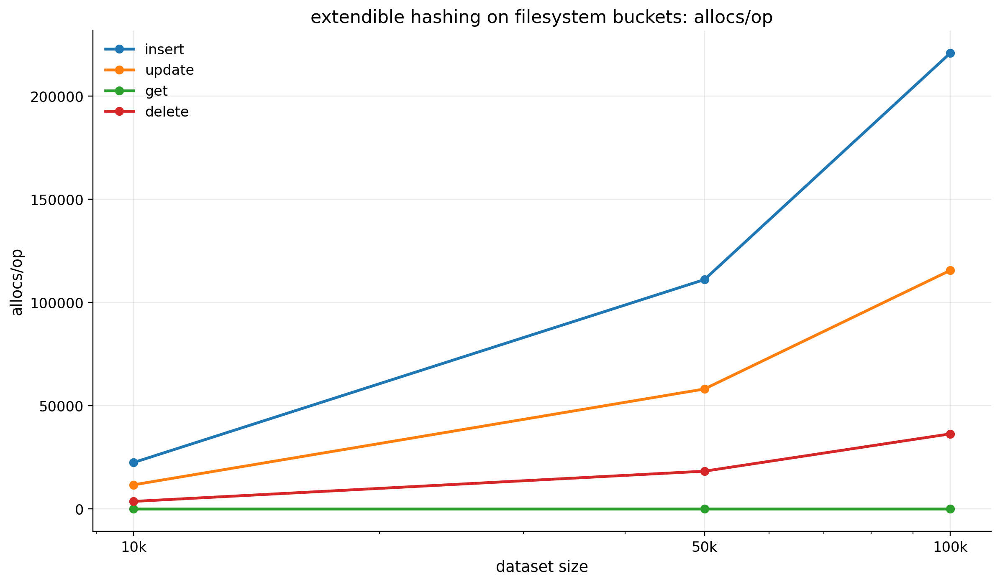

Insert и Update создают много временных объектов во время работы с bucket-ами и файлами, поэтому у них много аллокаций.
Delete после удаления записи может не просто изменить bucket, а еще запустить слияние bucket-ов (merge) и уменьшение directory (shrink), из-за чего приходится дополнительно читать, пересобирать и переписывать структуру.
поэтому Delete получается тяжелым не только по времени, но и по памяти.

#### Профилирование

Профиль снимался с `BenchmarkTableInsert`

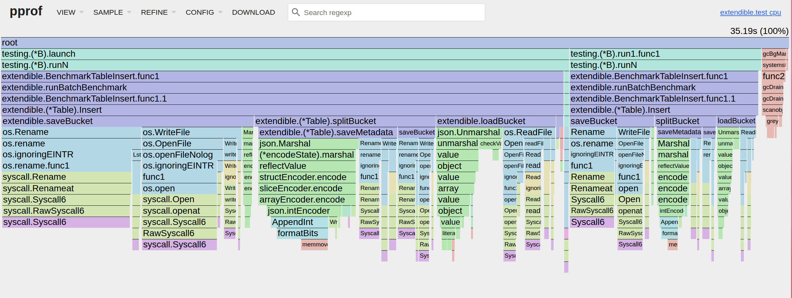


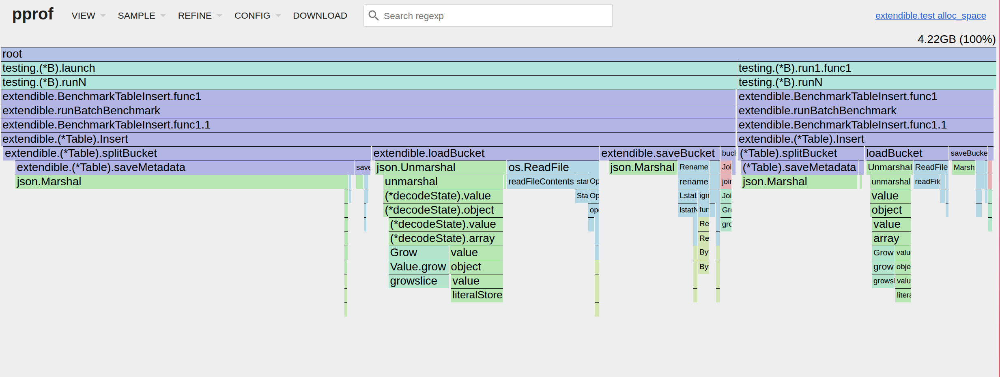

Гипотезы по улучшению:

- уйти с json на более компактный бинарный формат
- буферизовать запись bucket-ов
- уменьшить число повторных чтений metadata

После буферизации записи bucket-ов

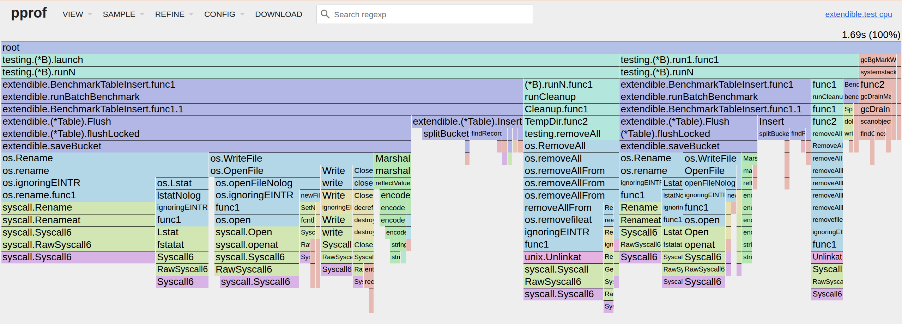

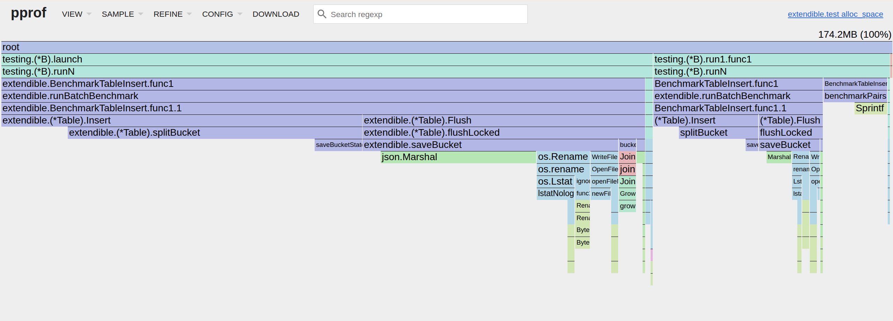

После изменения типа записи bucket-ов профиль стал заметно компактнее: суммарное CPU-время снизилось примерно с 35.19s до 1.69s, а alloc_space — с 4.22GB до 174.2MB. JSON-сериализация остаётся частью стоимости записи bucket-ов, однако после изменения механизма записи её влияние на общий объём аллокаций стало существенно ниже.

### Perfect hash

Для perfect hash я разделила замеры на два типа:

- `Build` за одну операцию полностью строится таблица по набору из `N` ключей.
- `Get` - таблица сначала строится один раз(не в счет), после чего в каждом прогоне выполняется фиксированное число lookup-ов по уже существующим ключам

#### Время построения

| size | build: ns/item (mean ± CI) |
| --- | ---: |
| 10000 | 2474.4 ± 57.0 |
| 100000 | 2396.8 ± 63.8 |
| 500000 | 2632.6 ± 45.6 |
| 1000000 | 2672.5 ± 22.8 |

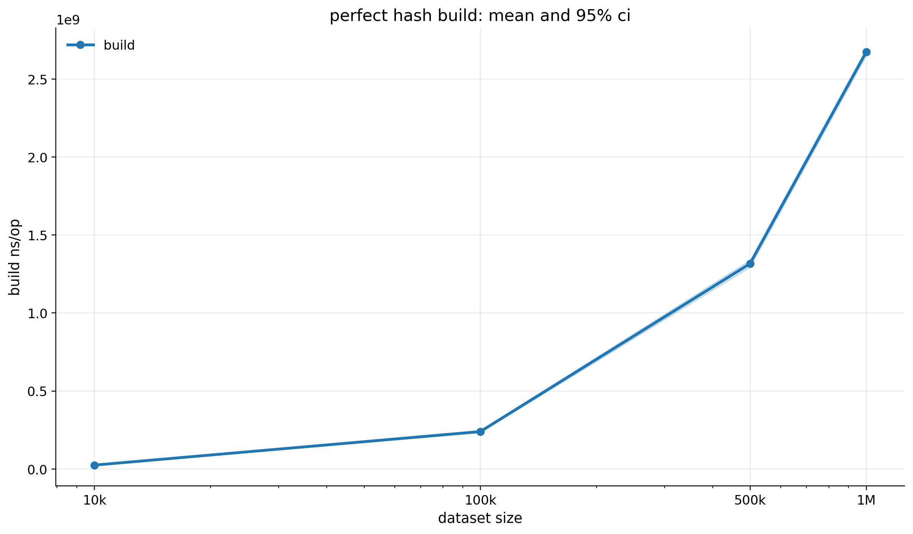

`Build` ожидаемо самая дорогая стадия, потому что именно здесь строится вся структура:
проверяются дубликаты, выполняется первичное разбиение по bucket-ам и подбираются вторичные таблицы.

#### Время поиска (100000 lookup-ов)

| size | get: ns/item (mean ± CI) | get ops/sec |
| --- | ---: | ---: |
| 10000 | 51.289 ± 0.376 | 19524605.86 |
| 100000 | 95.160 ± 4.970 | 10865194.66 |
| 500000 | 184.871 ± 4.628 | 5480773.89 |
| 1000000 | 219.642 ± 9.707 | 4750890.62 |

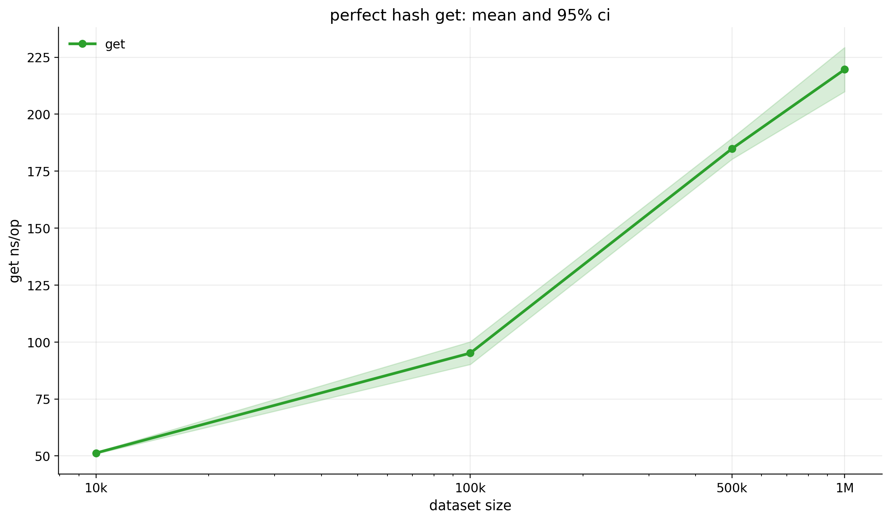

Меряем после построения всего датасета. lookup сводится к вычислению первичного и вторичного индекса и одной проверке в найденном `slot`. Рост времени Get объясняется ухудшением cache locality( при увеличении размера perfect hash таблицы нужные bucket-ы и slot-ы реже попадают в кэш CPU)

#### Память и аллокации 

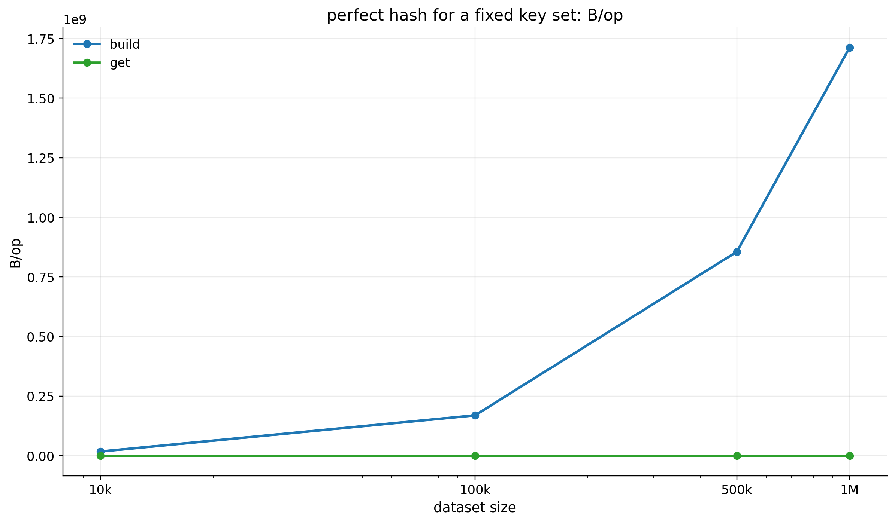

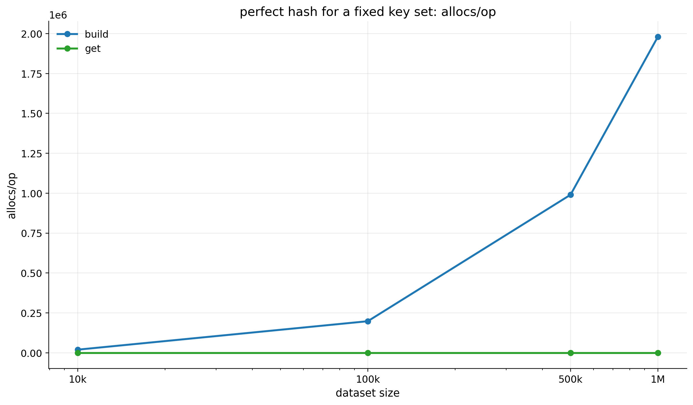


#### Профилирование

Профиль снимался с BenchmarkTableBuild

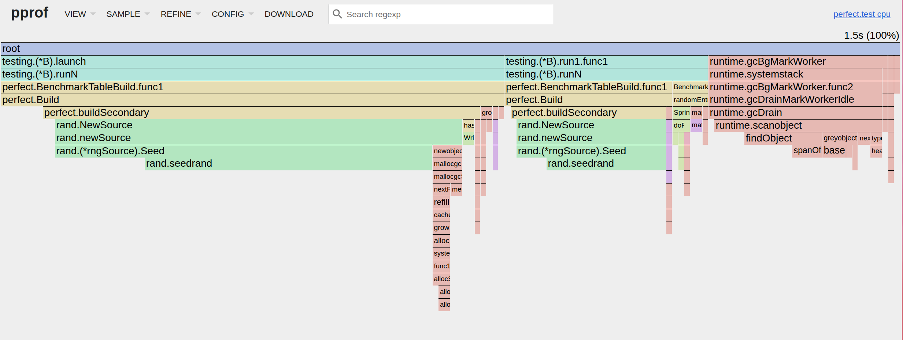

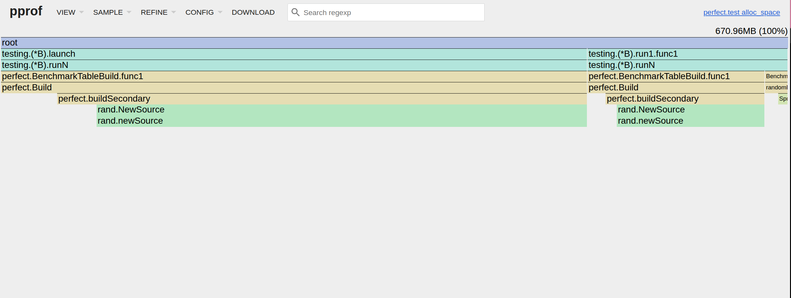

buildSecondary - строит вторичную таблицу для конкретного primary bucket’а (k^2). 
rand.NewSource - создание источника псевдослучайных чисел для генерации параметров a и b при построение вторичной таблицы 

Гипотезы по улучшению:

- генератор (rand.NewSource) создаётся для каждого bucket-а → можно вынести и переиспользовать один
- еще варинат вместо (rand.NewSource) генерировать a и b детерминированно

### LSH

Config{Tables: 4, CellSize: 0.5, Radius: 0.2, Seed: 1}

- Build - строится индекс по всему набору из `N` точек
- Add - измеряется вставка batch-а из `10%` от размера корпуса в уже построенный индекс размера `N`
- Search - на уже построенном индексе выполняется batch запросов поиска ближайших точек
- FullScan - для тех же запросов выполняется baseline без индекса, то есть полный перебор


#### Индексация

| size | build: batch ns/op | build: ns/item (mean ± CI) | add 10% batch ns/op | add: ns/item (mean ± CI) |
| --- | ---: | ---: | ---: | ---: |
| 10000 | 3678111 | 367.8 ± 110.0 | 1240175 | 1240.2 ± 115.8 |
| 100000 | 30243100 | 302.4 ± 23.4 | 14919900 | 1492.0 ± 163.7 |
| 500000 | 188316000 | 376.6 ± 16.2 | 87217630 | 1744.4 ± 102.9 |
| 1000000 | 418001000 | 418.0 ± 18.1 | 189194942 | 1891.9 ± 71.9 |

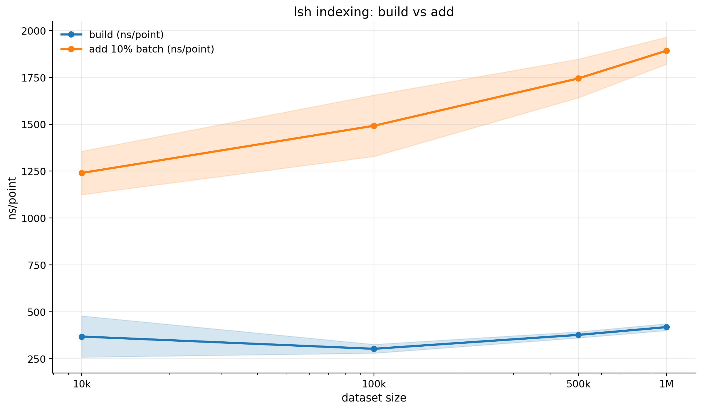

`Add` растет быстрее `Build`, потому что каждая новая точка вставляется в уже крупный индекс (buckets становятся тяжелее, чаще растут slice-ы, а работа с map-ами и памятью идет уже на фоне большой существующей структуры)


#### Поиск

Для `Search` и `FullScan` одна benchmark-операция — это не один query, а целый batch запросов.

| size | queries in batch | search: batch ns/op | search: ns/item (mean ± CI) | full scan: batch ns/op | full scan: ns/item (mean ± CI) |
| --- | ---: | ---: | ---: | ---: | ---: |
| 10000 | 50 | 8569890 | 171398 ± 10159 | 20217500 | 404350 ± 17890 |
| 100000 | 100 | 188712000 | 1887120 ± 35961 | 513209000 | 5132090 ± 191413 |
| 500000 | 200 | 2169630000 | 10848150 ± 189055 | 9734970000 | 48674850 ± 2111090 |
| 1000000 | 200 | 4601500000 | 23007500 ± 360892 | 22102200000 | 110511000 ± 2034780 |

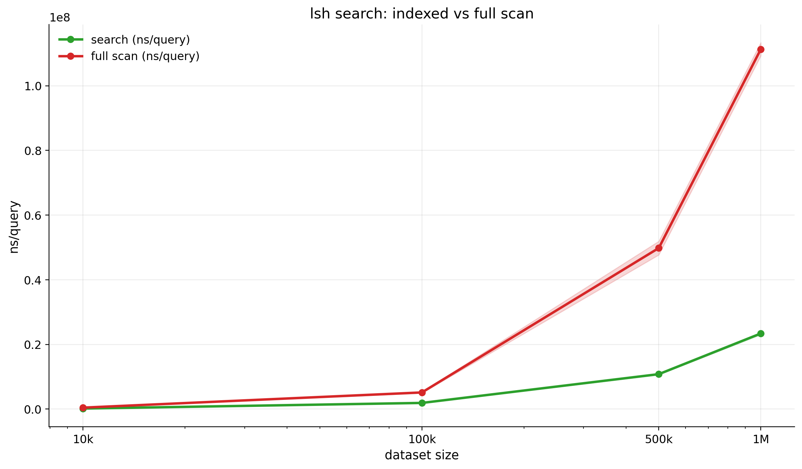

`Search` заметно дороже одной операции вставки, при этом все равно существенно лучше `FullScan`, потому что индекс резко сокращает число точек, для которых приходится выполнять точную проверку. Выигрыш сохраняется и на больших датасетах, хотя обе кривые растут из-за увеличения числа кандидатов и стоимости сортировки.

#### Профилирование

Профиль снимался с `BenchmarkTableSearch`, потому что именно индексный `Search` является главным пользовательским сценарием.

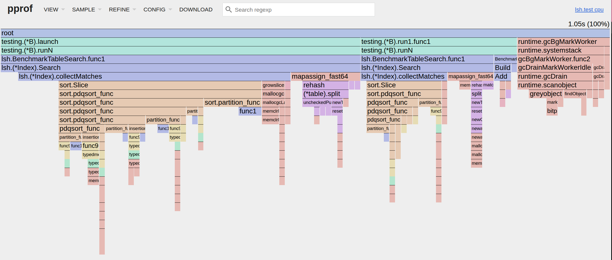

заметная часть времени уходит на collectMatches, особенно на сортировку результата через sort.Slice. Это связано с тем, что после отбора кандидатов дополнительно выполняется точная фильтрация по расстоянию и упорядочивание найденных точек. 

по улучшению так как сортировка является не обязательной ее можно убрать или оптимизировать, заменить полную сортировку на top-k

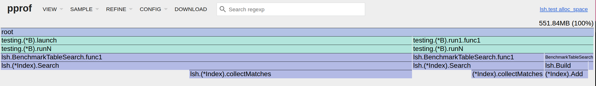


## Дополнительные Pprof-картинки

### Extendible hashing

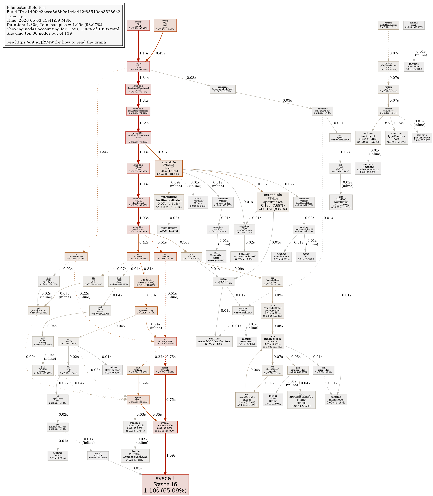

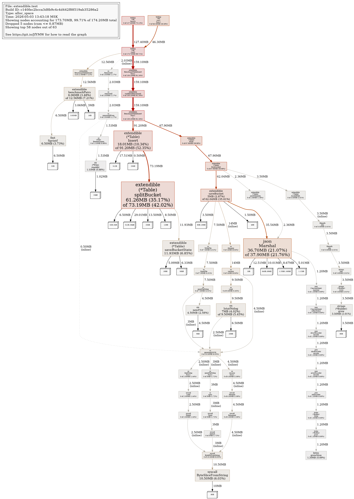

### Perfect hash

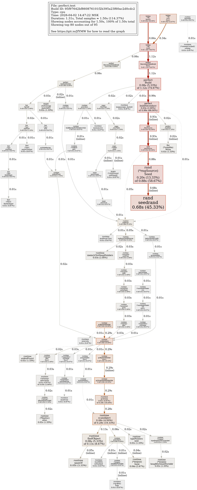

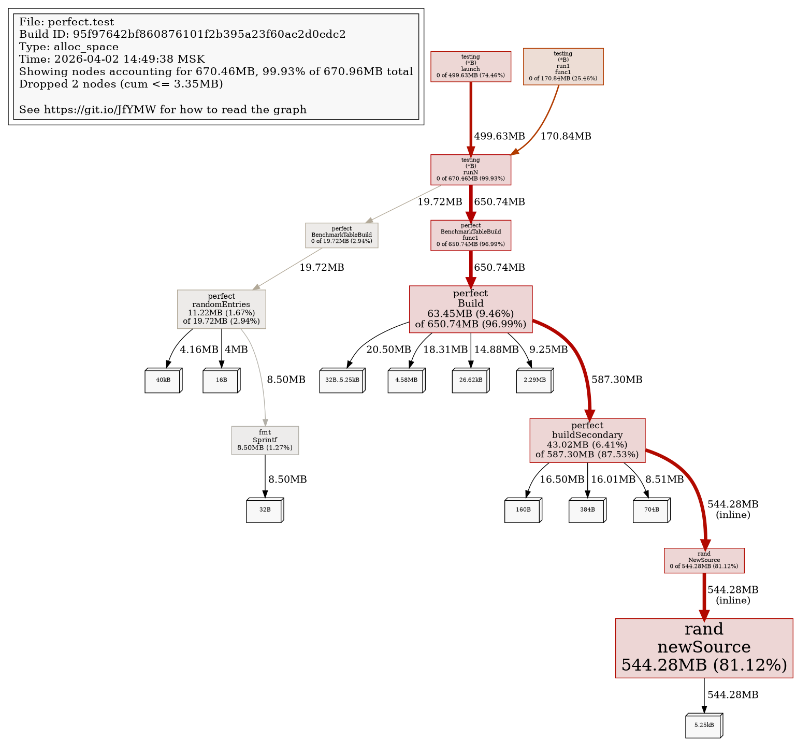

### LSH

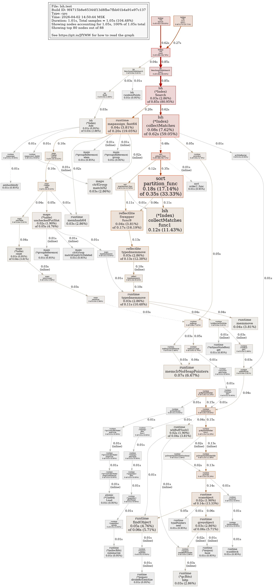

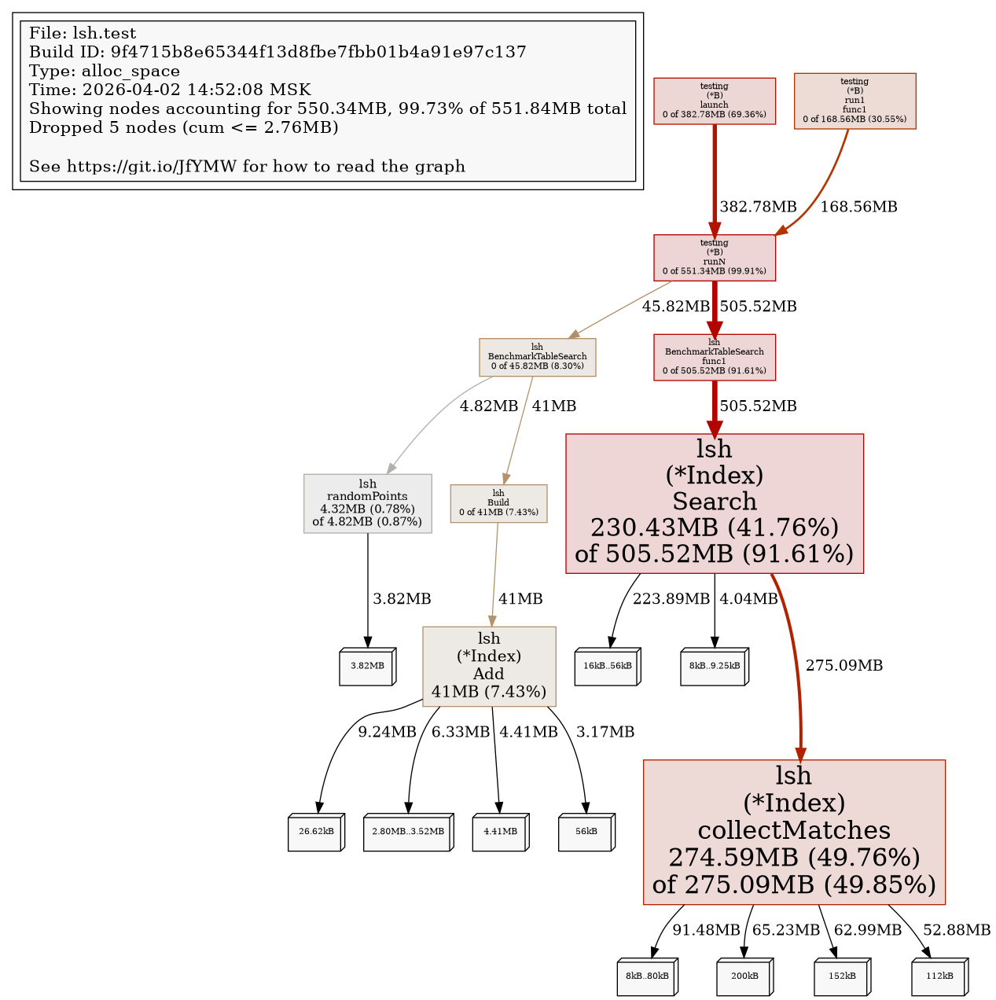
