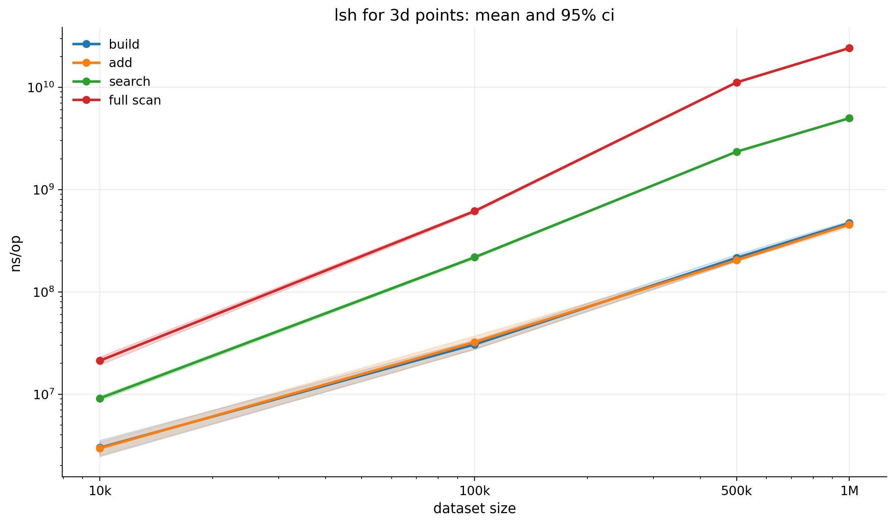

# HW1 - Hashing Algorithms

Выполнила Дусаева Элина.

В работе реализованы три структуры:

- `extendible hashing` на файловой системе;
- `perfect hash`;
- `LSH` для точек в `3D`.

## Конфигурация ПК

Все замеры и профилирование в этой работе снимались на следующей машине:

- ОС: `Ubuntu 24.04`, ядро `Linux 6.17.0-19-generic`
- Процессор: `13th Gen Intel(R) Core(TM) i5-13400F`
- Ядер: `10`
- Потоков: `16`
- Частота CPU: до `4.6 GHz`
- L3 cache: `20 MiB`
- Оперативная память: `31 GiB`
- Swap: `8 GiB`

### Как снимались замеры

Пайплайн для hw1 устроен так:

1. сначала делается warmup
2. затем запускается несколько независимых прогонов
3. каждый прогон сохраняется отдельно
4. после того считаются summary-таблицы

Основные команды:

```bash
cd hw1
make test
make metrics ALGO=extendible BENCH_RUNS=5 BENCH_TIME=3x WARMUP_TIME=1x WARMUP_SIZES=10000,50000 SIZES=10000,50000,100000
make metrics ALGO=perfect BENCH_RUNS=5 BENCH_TIME=3x WARMUP_TIME=1x WARMUP_SIZES=10000,100000 SIZES=10000,100000,500000,1000000
make metrics ALGO=lsh BENCH_RUNS=5 BENCH_TIME=3x WARMUP_TIME=1x WARMUP_SIZES=10000,100000 SIZES=10000,100000,500000,1000000
make profile ALGO=extendible PROFILE_SIZE=100000 BENCH_TIME=3x
make profile ALGO=perfect PROFILE_SIZE=100000 BENCH_TIME=3x
make profile ALGO=lsh PROFILE_SIZE=100000 BENCH_TIME=3x
make cpu-web ALGO=extendible PROFILE_SIZE=100000 CPU_PPROF_HTTP=:8089
make mem-web ALGO=extendible PROFILE_SIZE=100000 MEM_PPROF_HTTP=:8090
make cpu-web ALGO=perfect PROFILE_SIZE=100000 CPU_PPROF_HTTP=:8091
make mem-web ALGO=perfect PROFILE_SIZE=100000 MEM_PPROF_HTTP=:8092
make cpu-web ALGO=lsh PROFILE_SIZE=100000 CPU_PPROF_HTTP=:8093
make mem-web ALGO=lsh PROFILE_SIZE=100000 MEM_PPROF_HTTP=:8094
```

## Что получилось по результатам

В целом по результатам получилась довольно ожидаемая картина:

- extendible hashing сильно страдает от файловой природы реализации, особенно на insert и delete
- perfect hash показывает очень стабильный и быстрый lookup даже на 1e6 ключей
- LSH заметно выигрывает у FullScan, но все равно растет с размером корпуса, потому что увеличивается число кандидатов и стоимость проверки

## Графики и результаты

### Extendible hashing

benchmark'и измеряет полный сценарий работы с набором размера `N`.

- Insert - создается пустая таблица, затем в нее последовательно вставляются все N пар key/value
- Update - сначала в таблицу вставляются N записей, затем для всех этих ключей выполняется обновление значений
- Get - сначала в таблицу вставляются N записей, затем для всех N ключей выполняется поиск
- Delete - сначала в таблицу вставляются N записей, затем все N записей удаляются.

Из-за этого `ns/op` здесь нужно читать как стоимость полного batch-сценария на наборе размера `N`, а не как цену одной отдельной записи.

#### Задержка операций

| size | insert mean ns/op | insert 95% CI | update mean ns/op | update 95% CI | get mean ns/op | get 95% CI | delete mean ns/op | delete 95% CI |
| --- | ---: | ---: | ---: | ---: | ---: | ---: | ---: | ---: |
| 10000 | 699442000 | 294408000 | 483281000 | 65389800 | 129141000 | 2518280 | 1193467073 | 111987000 |
| 50000 | 3330970000 | 262659000 | 2395630000 | 120297000 | 639801000 | 18298600 | 10068600000 | 168800000 |
| 100000 | 7246846103 | 142863000 | 4737630000 | 59916300 | 1267340000 | 9250380 | 33682000000 | 51858700 |


Get оказался самой дешевой операцией, потому что он не меняет структуру таблицы и сводится к вычислению хеша, чтению нужного bucket-а и поиску записи внутри него. 

Update тоже ведет себя относительно стабильно: несмотря на запись на диск, он не требует split/merge bucket-ов и не перестраивает directory. 

Insert же дорожает из-за split bucket-ов и возможного расширения directory.

Delete оказывается самой тяжелой операцией, потому что в моей реализации после удаления дополнительно выполняются merge и shrink, что приводит к большому числу чтений и перезаписей файлов.`

#### Память и аллокации 


Insert и Update создают много временных объектов во время работы с bucket-ами и файлами, поэтому у них много аллокаций.
Delete после удаления записи может не просто изменить bucket, а еще запустить слияние bucket-ов (merge) и уменьшение directory (shrink), из-за чего приходится дополнительно читать, пересобирать и переписывать структуру.
поэтому Delete получается тяжелым не только по времени, но и по памяти.

#### Профилирование

Профиль снимался с `BenchmarkTableInsert`


основная стоимость вставки сосредоточена в связке операций чтения и записи bucket-файлов, JSON-сериализации и переразбиения bucket-ов. В реализации Insert каждая операция обращается к диску через loadBucket, а при успешной вставке выполняет полную сериализацию и перезапись бакета через saveBucket. 

при переполнении бакета дополнительно вызывается splitBucket, который перераспределяет записи, обновляет directory и сохраняет несколько структур на диск. Поэтому с ростом числа данных вставка дорожает главным образом из-за файлового I/O, json.Marshal / json.Unmarshal и стоимости split-операций.


Гипотезы по улучшению:

- уйти с json на более компактный бинарный формат
- буферизовать запись bucket-ов
- уменьшить число повторных чтений metadata

### Perfect hash

Для perfect hash я разделила замеры на два типа:

- `Build` измеряется обычным Go benchmark'ом: за одну операцию полностью строится таблица по набору из `N` ключей.
- `Get` - таблица сначала строится один раз, после чего в каждом прогоне выполняется фиксированное число lookup-ов по уже существующим ключам

#### Время построения

| size | build ns/op | build 95% CI |
| --- | ---: | ---: |
| 10000 | 24744400 | 569667 |
| 100000 | 239681000 | 6378790 |
| 500000 | 1316310000 | 22794700 |
| 1000000 | 2672484798 | 22812100 |


`Build` ожидаемо оказывается самой дорогой стадией, потому что именно здесь строится вся структура:
проверяются дубликаты, выполняется первичное разбиение по bucket-ам и подбираются вторичные таблицы.

#### Время поиска (100000 lookup-ов)

| size | get avg ns/op | get 95% CI, ns | get ops/sec |
| --- | ---: | ---: | ---: |
| 10000 | 51.289 | 0.376 | 19524605.86 |
| 100000 | 95.160 | 4.970 | 10865194.66 |
| 500000 | 184.871 | 4.628 | 5480773.89 |
| 1000000 | 219.642 | 9.707 | 4750890.62 |


Меряем после построения всего датасета. lookup сводится к вычислению первичного и вторичного индекса и одной проверке в найденном `slot`. Рост времени Get объясняется ухудшением cache locality( при увеличении размера perfect hash таблицы нужные bucket-ы и slot-ы реже попадают в кэш CPU)

#### Память и аллокации 


#### Профилирование

Профиль снимался с BenchmarkTableBuild


buildSecondary - строит вторичную таблицу для конкретного primary bucket’а (k^2). 
rand.NewSource - создание источника псевдослучайных чисел для генерации параметров a и b при построение вторичной таблицы 

Гипотезы по улучшению:

- генератор (rand.NewSource) создаётся для каждого bucket-а → можно вынести и переиспользовать один
- еще варинат вместо (rand.NewSource) генерировать a и b детерминированно

### LSH

- Build - строится индекс по всему набору из N точек
- Add - создается пустой индекс, после чего в него по одной добавляются все точки
- Search - на уже построенном индексе выполняется серия запросов поиска ближайших точек;
- FullScan - для тех же запросов выполняется baseline без индекса, то есть полный перебор.

| size | build ns/op | build 95% CI | add ns/op | add 95% CI | search ns/op | search 95% CI | full scan ns/op | full scan 95% CI |
| --- | ---: | ---: | ---: | ---: | ---: | ---: | ---: | ---: |
| 10000 | 2994721 | 537416 | 2949900 | 437212 | 9104210 | 448405 | 21219900 | 1926930 |
| 100000 | 30601700 | 3142480 | 32239500 | 4809830 | 217810000 | 6821440 | 615462000 | 20271900 |
| 500000 | 214973000 | 17298800 | 204283000 | 4099180 | 2344810000 | 19465300 | 11156800000 | 184752000 |
| 1000000 | 470677000 | 23689600 | 456007000 | 26534100 | 4986250000 | 56231300 | 24177017103 | 222786000 |



Build и Add растут достаточно ровно, потому что в обоих случаях каждая точка независимо отображается в несколько таблиц и добавляется в соответствующие bucket-ы. 

Search заметно дороже построения одной точки, поскольку поиск требует обхода нескольких соседних ячеек, объединения кандидатов и точной фильтрации по расстоянию. При этом Search все равно существенно лучше FullScan, потому что индекс сокращает число точек, для которых приходится выполнять точную проверку. FullScan остается самым тяжелым baseline, поскольку фактически делает полный перебор и его стоимость быстро растет вместе с размером корпуса.

#### Профилирование

Профиль снимался с `BenchmarkTableSearch`, потому что именно индексный `Search` является главным пользовательским сценарием.


основная цена поиска связана с обходом таблиц и соседних ячеек, сбором кандидатов и последующей точной фильтрацией по расстоянию. узкое место в кандидатах, а не только в вычислении самих хешей.


Гипотезы по улучшению:

- сортировка (sort.Slice) — главный bottleneck
→ уменьшить размер данных для сортировки
- map → уменьшить количество вставок или заранее задавать размер (capacity)

## Дополнительные Pprof-картинки

### Extendible hashing


### Perfect hash


### LSH


