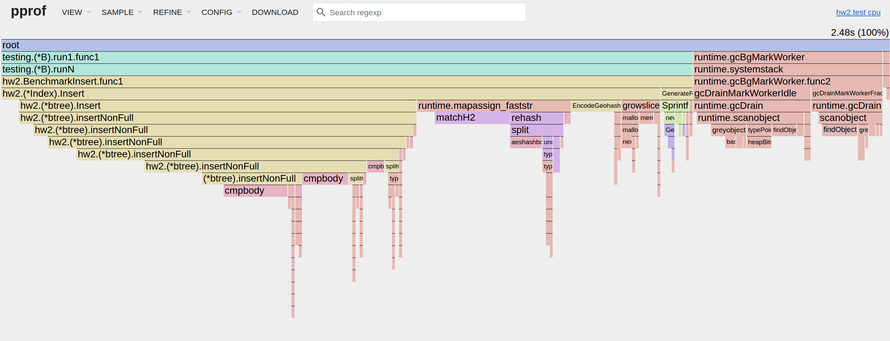
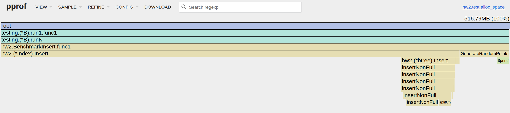
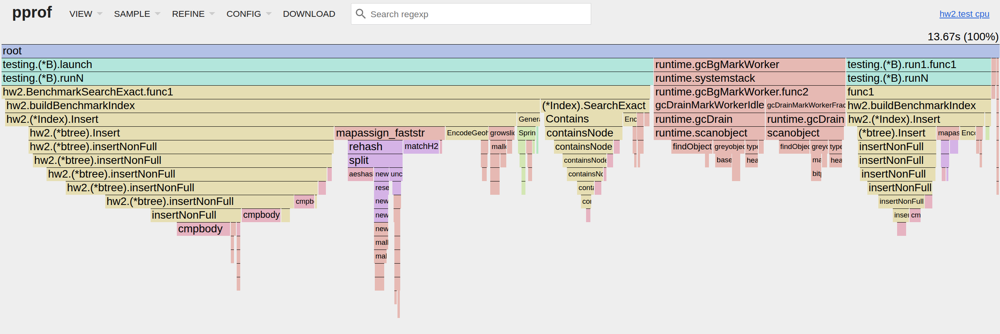
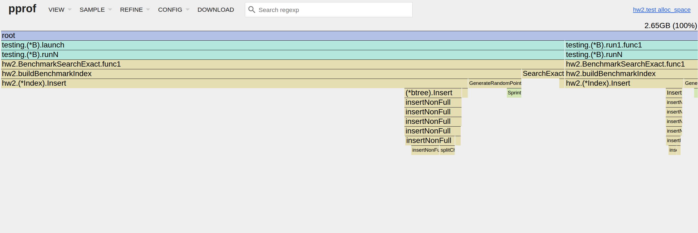
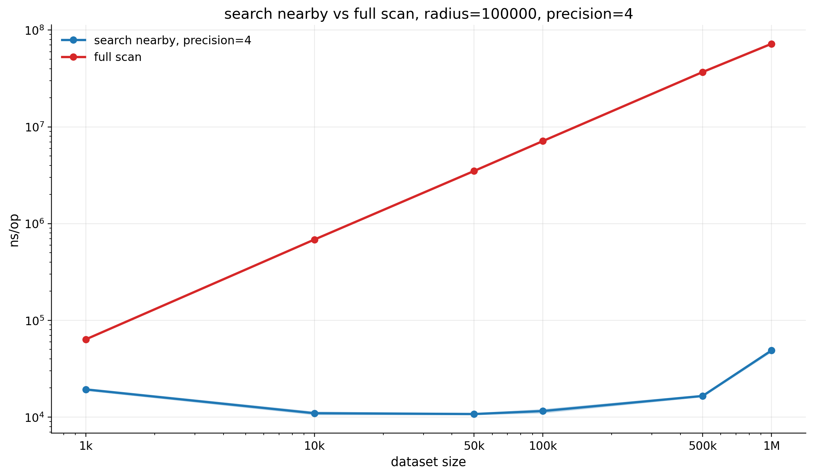
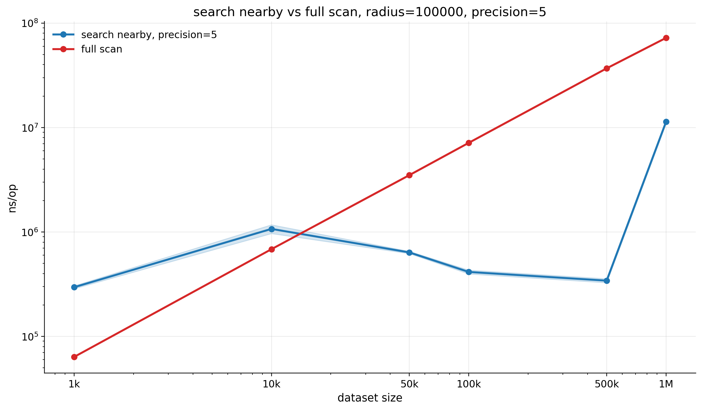
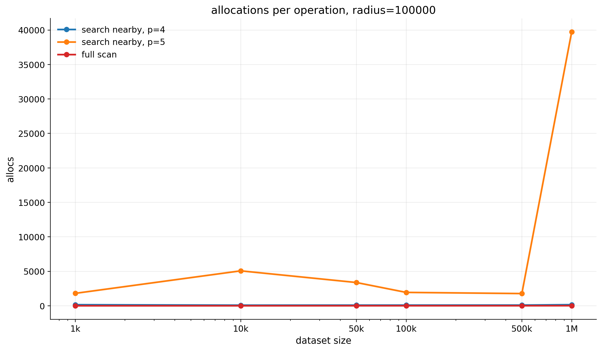
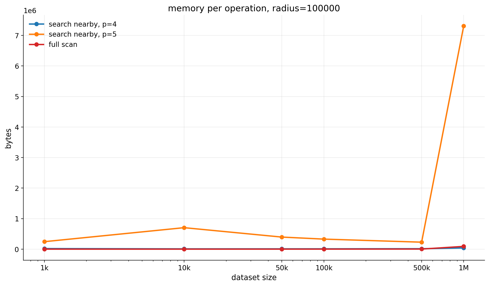
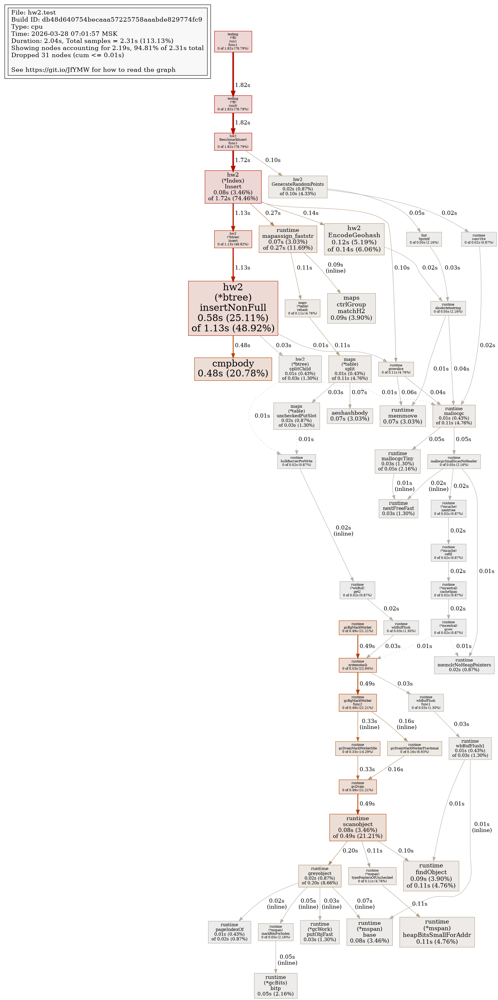
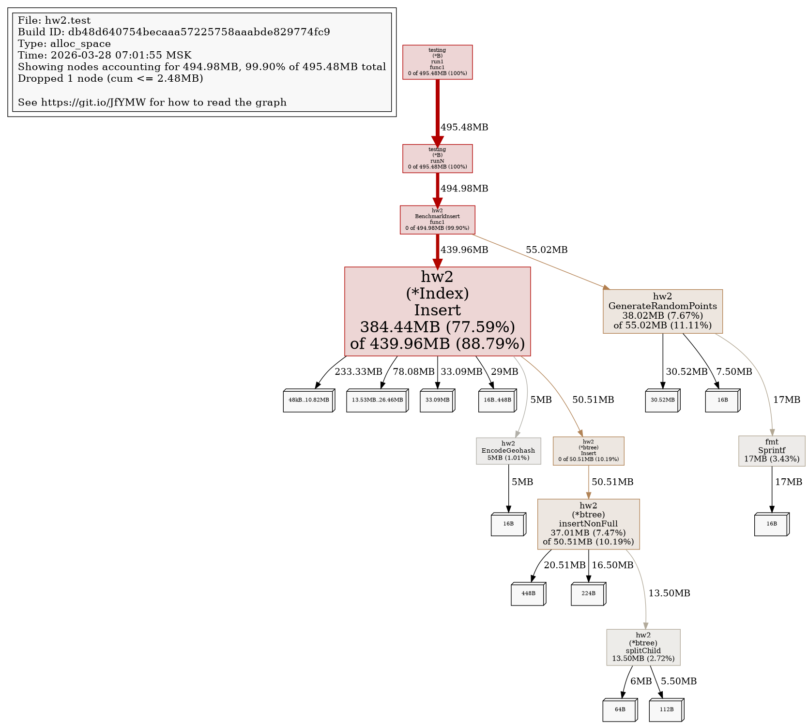

# HW2 - Геопоиск по Lat/Lng

Выполнила Дусаева Элина.

## Общая идея решения

В основе решения лежит следующая идея:

- координаты кодируются в `geohash`;
- geohash используется как ключ;
- geohash-ключи хранятся в `B-tree`;
- сами объекты лежат в `map[string][]GeoObject`;
- для проверки корректности есть baseline `FullScan`, который просто делает полный перебор.

### Что реализовано

- `Insert` - добавление объекта в индекс;
- `SearchExact` - точный поиск по координатам;
- `SearchNearby` - поиск объектов в радиусе от точки;
- `FullScan` - baseline без индекса;
- генератор случайных данных;
- функциональные тесты;
- benchmark'и;
- CPU profiling;
- memory profiling;
- сохранение сырых результатов, summary-таблиц и графиков.

<!-- ## Гипотезы
Индексный nearby-поиск должен быть существенно быстрее полного перебора на больших наборах данных, т.к. сначала сужает множество кандидатов до bucket’ов релевантных geohash-ячеек, а затем делает точную проверку расстояния.

SearchExact должен быть очень быстрым и слабо зависеть от размера набора, потому что работает в пределах одного bucket’а (и проверяет точное совпадение координат внутри него).

Есть компромисс по параметру precision (geohash):
слишком маленькая точность ⇒ крупные ячейки ⇒ много «лишних» кандидатов;
слишком большая точность ⇒ мелкие ячейки ⇒ nearby-поиску приходится обходить много соседних ячеек, растут накладные расходы;
значит, в районе «середины» возможен более удачный баланс. -->

## Как устроено решение

Основная логика лежит в `index.go`.

При вставке: координаты объекта переводятся в `geohash` -> ключ добавляется в `B-tree` -> объект кладется в bucket по этому `geohash` -> отдельно объект сохраняется в общий срез для `FullScan`.

Точный поиск: для точки запроса строится `geohash` -> из индекса берется bucket этой ячейки. Дальше внутри bucket остаются только объекты с точно такими же `Lat` и `Lng`. То есть сейчас `SearchExact` уже не возвращает просто всю geohash-ячейку, а именно делает точное совпадение по координатам.

Nearby-поиск - вокруг точки строится bounding box, по нему вычисляется набор geohash-ячеек, которые покрывают окно поиска(из индекса вытаскиваются только эти buckets) Потом уже идет точная фильтрация по haversine, результат сортируется по расстоянию.


## Где была сложность

Самая неприятная часть была в `SearchNearby`.

Первоначально nearby-поиск планировалось строить поверх `B-tree`, однако на практике это не дало выигрыша: узким местом оказались не операции дерева, а количество кандидатов, аллокации и последующая фильтрация по расстоянию. Поэтому итоговая реализация nearby-поиска опирается на geohash bucket-ы и прямой доступ через `map`.

Дополнительно на случайных тестах быстро появились расхождения с `FullScan`, потому что:

- точки терялись на границах geohash-ячеек;
- появлялись сложные случаи около `-180/180` по долготе;
- большие радиусы запроса уже не укладывались в маленький набор соседних ячеек;
- около полюсов оценка охвата по долготе ведет себя не очень стабильно.

Из-за этого nearby-поиск пришлось сначала строить окно поиска, потом вычислять набор geohash-ячеек, который это окно покрывает, потом брать кандидатов только из этих ячеек. И уже после этого делать точную проверку по реальному расстоянию.
 
## Конфигурация ПК
Все замеры и профилирование в этой работе снимались на следующей машине:

- ОС: `Ubuntu 24.04`, ядро `Linux 6.17.0-19-generic`
- Процессор: `13th Gen Intel(R) Core(TM) i5-13400F`
- Ядер: `10`
- Потоков: `16`
- Частота CPU: до `4.6 GHz`
- L3 cache: `20 MiB`
- Оперативная память: `31 GiB`
- Swap: `8 GiB`
## Бенчмарки

Бенчмарки лежат в `benchmark_test.go`.

Сейчас замеряются:

- `Insert`
- `SearchExact`
- `SearchNearby`
- `FullScan`

Размеры данных:

- `1000`
- `10000`
- `50000`
- `100000`
- `500000`
- `1000000`

Для `SearchNearby` отдельно меняются:

- `precision = 4` и `5`
- `radius = 1000` и `100000`

Основные команды:

```bash
make test
make bench
make bench-save
make plot
make cpuprofile
make memprofile
make cpu-framegraph
make mem-framegraph
make exact-cpuprofile
make exact-memprofile
make exact-cpu-framegraph
make exact-mem-framegraph
```
## Что получилось по результатам

По результатам видно довольно ожидаемую картину:

- `SearchExact` остается быстрым даже на больших размерах, потому что поиск идет только внутри одного bucket;
- `Insert` с ростом размера данных начинает выглядеть уже не как почти линейный график, а как более дорогая зависимость;
- `SearchNearby` при `precision=4` стабильно быстрее `FullScan`;
- `precision=5` на больших радиусах и больших `n` резко ухудшает картину по времени и памяти.

Гипотеза здесь такая:

- если `precision` слишком маленький, ячейки крупные, и в кандидаты может попадать слишком много лишних объектов;
- если `precision` слишком большой, ячейки мелкие, и nearby-поиску приходится обходить уже слишком много соседних ячеек;
- поэтому где-то посередине появляется более удачный баланс.

По текущим замерам как раз видно, что `precision=4` во многих случаях ведет себя практичнее, чем `precision=5`.

# Доработки

- после сдачи решила добавить еще несколько точек для тестирования на больших данных. Из-за этого в графиках и таблицах появились дополнительные размеры `500000` и `1000000`, чтобы лучше увидеть поведение структуры на более крупном масштабе. Например, стало возможно увидеть логарифмичекую зависимость в вставке!

## Графики

### Insert

| size | mean ns/op | 95% CI |
| --- | ---: | ---: |
| 1000 | 413988 | 16187.6 |
| 10000 | 5887100 | 348789 |
| 50000 | 37655825 | 2870770 |
| 100000 | 83060100 | 1464390 |
| 500000 | 760847000 | 11898100 |
| 1000000 | 1809053445 | 69680800 |


После расширения диапазона по `n` стало заметно, что зависимость уже выглядит не как строго линейная. На маленьких размерах график еще можно было воспринимать почти линейным, но на `500000` и `1000000` элементов рост становится заметно тяжелее, что хорошо согласуется с логарифмической добавкой в стоимости вставки через `B-tree`.



Сделала framegraph для вставки, по нему видно  что основная нагрузка действительно остается внутри вставки в индекс. Стоимость складывается из нескольких частей сразу: вставка в `B-tree`, вычисление `geohash` и работа с bucket-ами в `map`.



По memory framegraph я вижу похожую картину со стороны памяти: основная часть аллокаций появляется прямо во время построения индекса, а не где-то во внешнем коде. Из этого я делаю вывод, что при дальнейшей оптимизации вставки мне в первую очередь нужно смотреть на уменьшение числа промежуточных аллокаций, рост слайсов и перераспределения внутри `B-tree` и bucket-ов.

### SearchExact

| size | mean ns/op | 95% CI |
| --- | ---: | ---: |
| 1000 | 114.75 | 2.02032 |
| 10000 | 276.75 | 2.69871 |
| 50000 | 200.75 | 3.23796 |
| 100000 | 260.25 | 27.491 |
| 500000 | 320.5 | 4.83423 |
| 1000000 | 327.25 | 24.1164 |


`SearchExact` остается очень быстрым и растет с размером набора довольно слабо(расчет для 10к был выбросом). Даже на `1000000` объектов время остается в районе сотен наносекунд, потому что поиск не идет по всему набору данных, а работает внутри одного bucket, найденного по `geohash`.



По CPU profile для `SearchExact` я вижу ожидаемую картину: поиск быстро сводится к вычислению `geohash`, обращению к нужному bucket и проверке точного совпадения координат.



По memory profile точечный поиск устроен довольно экономно и не требует дальнейших оптимизаций, память здесь не раздувается, потому что не нужно строить большой список кандидатов и не нужно обходить много соседних ячеек.

### SearchNearby vs FullScan, radius=1000, precision=4

| size | nearby ns/op | nearby 95% CI | full scan ns/op | full scan 95% CI |
| --- | ---: | ---: | ---: | ---: |
| 1000 | 441.25 | 5.95439 | 64156.8 | 666.404 |
| 10000 | 464.75 | 8.55748 | 687010 | 8645.31 |
| 50000 | 455.25 | 14.544 | 3538368 | 68940.3 |
| 100000 | 440 | 8.58083 | 7176991 | 96277.7 |
| 500000 | 531 | 7.15691 | 36903400 | 615757 |
| 1000000 | 465.25 | 11.3831 | 72110776 | 339723 |


При `radius=1000` и `precision=4` nearby-поиск держится примерно в диапазоне `440-530 ns/op` даже при росте до `1000000` объектов. На этом фоне `FullScan` растет почти пропорционально размеру набора и уходит уже в десятки миллионов наносекунд, так что индексный поиск здесь стабильно выигрывает очень сильно.

### SearchNearby vs FullScan, radius=1000, precision=5

| size | nearby ns/op | nearby 95% CI | full scan ns/op | full scan 95% CI |
| --- | ---: | ---: | ---: | ---: |
| 1000 | 509.5 | 6.81317 | 64156.8 | 666.404 |
| 10000 | 676 | 62.5206 | 687010 | 8645.31 |
| 50000 | 534.5 | 19.5755 | 3538368 | 68940.3 |
| 100000 | 472.75 | 5.02101 | 7176991 | 96277.7 |
| 500000 | 496.25 | 8.44451 | 36903400 | 615757 |
| 1000000 | 1359.25 | 45.9756 | 72110776 | 339723 |


При `radius=1000` и `precision=5` nearby-поиск тоже остается намного быстрее `FullScan`, но по сравнению с `precision=4` уже выглядит менее стабильным. Особенно это заметно на `1000000` объектов, где время подскакивает до `1359 ns/op`, что хорошо показывает дополнительный накладной расход на более мелкие ячейки.

### SearchNearby vs FullScan, radius=100000, precision=4

| size | nearby ns/op | nearby 95% CI | full scan ns/op | full scan 95% CI |
| --- | ---: | ---: | ---: | ---: |
| 1000 | 19310.5 | 444.905 | 63626.8 | 323.488 |
| 10000 | 10964.5 | 370.814 | 684007 | 4511.01 |
| 50000 | 10755.8 | 158.676 | 3502030 | 45585.9 |
| 100000 | 11547 | 497.395 | 7138590 | 78522.8 |
| 500000 | 16537 | 303.069 | 36886700 | 451637 |
| 1000000 | 48767.5 | 1474.57 | 72205600 | 940247 |



Даже на большом радиусе `100000` вариант с `precision=4` остается практичным: nearby-поиск растет, но все еще уверенно лучше `FullScan`. Здесь `precision=4` дает удачный баланс между размером ячеек, числом кандидатов и количеством обходов соседних bucket-ов.

### SearchNearby vs FullScan, radius=100000, precision=5

| size | nearby ns/op | nearby 95% CI | full scan ns/op | full scan 95% CI |
| --- | ---: | ---: | ---: | ---: |
| 1000 | 295904 | 9616.48 | 63626.8 | 323.488 |
| 10000 | 1070100 | 102952 | 684007 | 4511.01 |
| 50000 | 637350 | 16496.7 | 3502030 | 45585.9 |
| 100000 | 414367 | 17748.1 | 7138590 | 78522.8 |
| 500000 | 341987 | 15144.8 | 36886700 | 451637 |
| 1000000 | 11359800 | 430060 | 72205600 | 940247 |



Здесь разница с `precision=4` уже очень заметна. На большом радиусе и больших размерах данных слишком мелкие ячейки заставляют обходить слишком много соседних bucket-ов, и в результате стоимость nearby-поиска резко вырастает. Особенно это видно на `1000000` объектов, где время доходит до `11.36 ms/op`.

### Allocations

| size | precision=4 allocs/op | precision=5 allocs/op |
| --- | ---: | ---: |
| 1000 | 156 | 1803 |
| 10000 | 87 | 5068 |
| 50000 | 92 | 3375 |
| 100000 | 95 | 1941 |
| 500000 | 99 | 1772 |
| 1000000 | 160 | 39726 |



По числу аллокаций `precision=4` выглядит заметно стабильнее. У `precision=5` уже на средних размерах данных появляются тысячи аллокаций на операцию, а на `1000000` объектов значение вырастает до `39726 allocs/op`, что хорошо объясняет провалы по времени.

### Memory

| size | precision=4 bytes/op | precision=5 bytes/op |
| --- | ---: | ---: |
| 1000 | 18360 | 244754.5 |
| 10000 | 9232 | 703186 |
| 50000 | 9600 | 395250.5 |
| 100000 | 10336 | 328621 |
| 500000 | 14112 | 228368.25 |
| 1000000 | 39516 | 7307781 |



По памяти картина такая же: `precision=4` тратит сравнительно немного, а `precision=5` на больших данных начинает расходовать уже сотни килобайт и даже мегабайты на одну операцию. На `1000000` объектов это уже `7307781 bytes/op`, так что проблема видна не только по времени, но и по объему временных данных.

### CPU Profile



### Memory Profile


