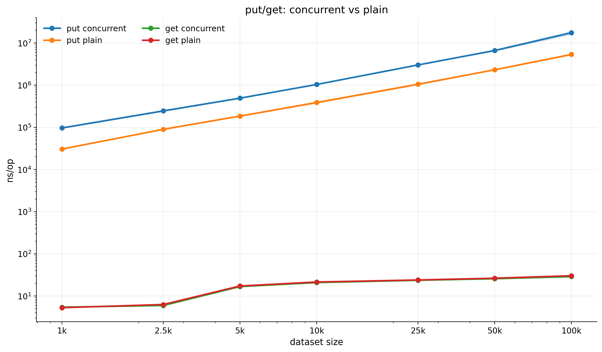
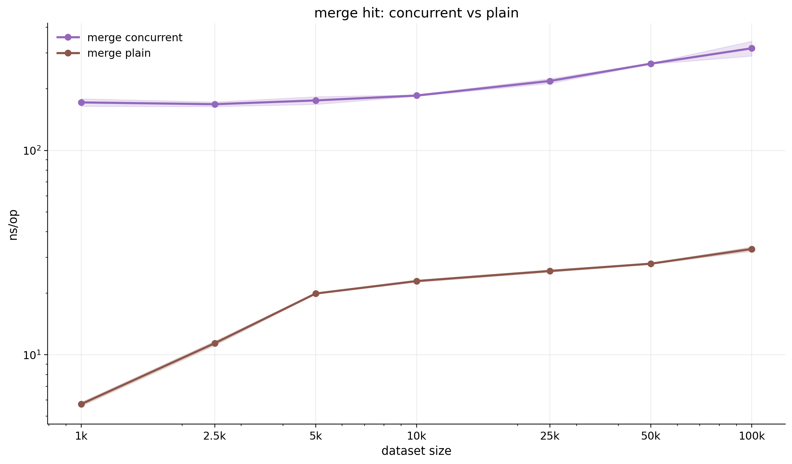
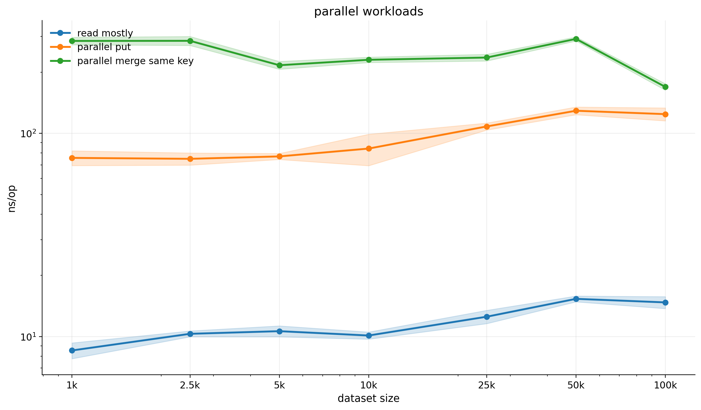
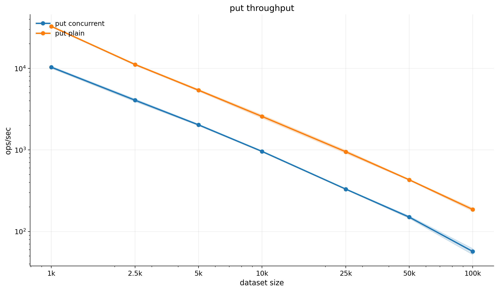
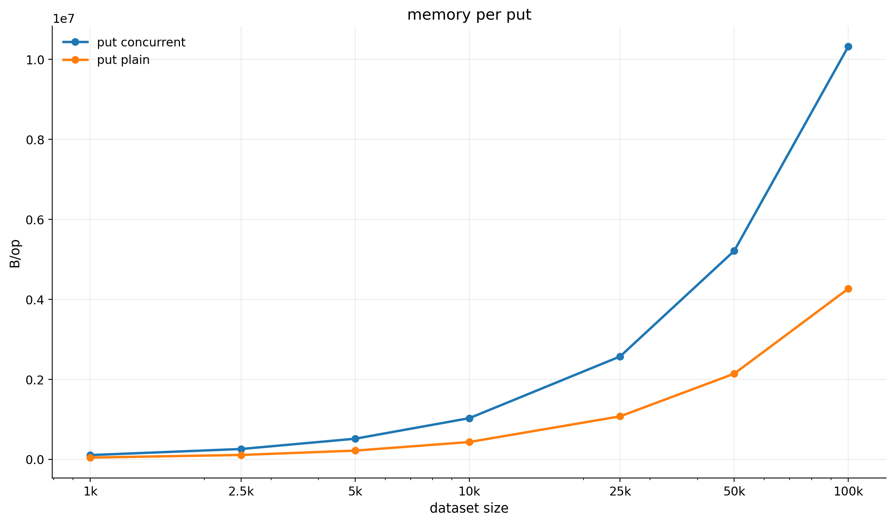
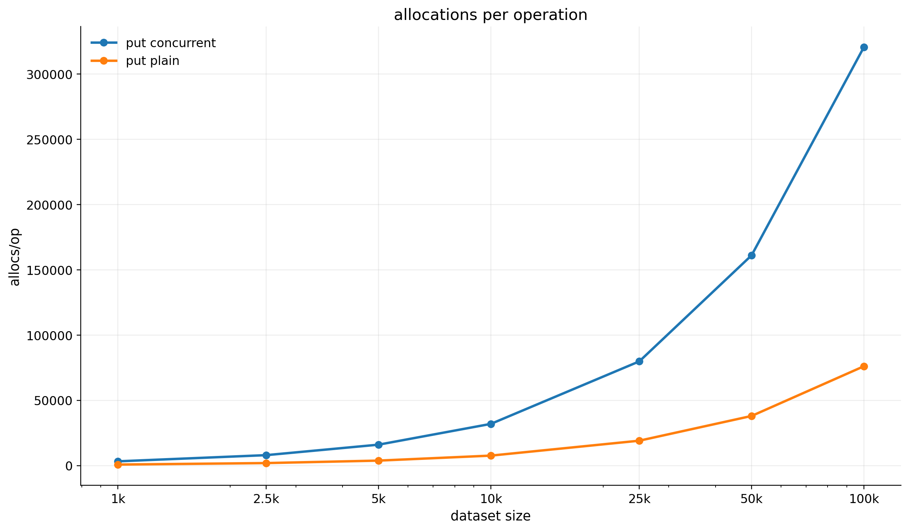
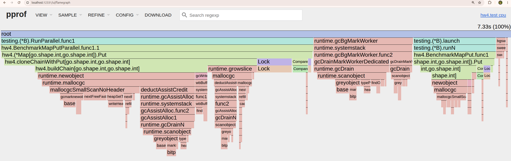
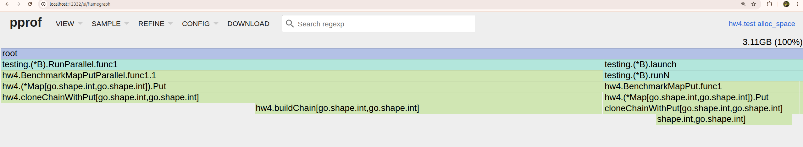
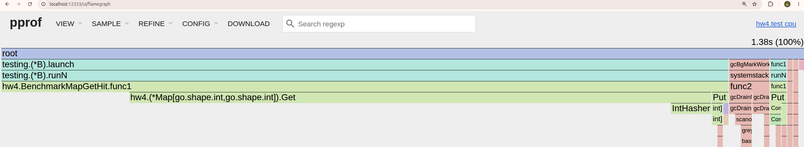
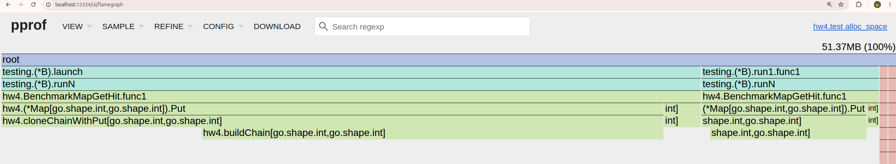

# HW4 - Concurrent Hash Map

Выполнила Дусаева Элина.

## Общая идея решения

В этой лабораторной работе я реализовала `thread-safe` hash map с закрытой адресацией, где:

- чтения идут без взятия глобальных блокировок
- запись работает по bucket-ам
- состояние bucket-а публикуется через `CAS`
- при росте числа элементов таблица автоматически делает `resize`

Базовая идея такая:

- вся таблица хранится как атомарно опубликованный указатель на текущую структуру bucket-ов
- внутри каждого bucket-а лежит immutable chain
- `Get` только атомарно читает текущую таблицу и голову цепочк
- `Put` и `Merge` под локом конкретного bucket-а собирают новую версию цепочки и публикуют ее через `CompareAndSwap`
- `resize` строит новую таблицу большего размера и потом атомарно подменяет указатель на нее

То есть чтения в нормальном случае не блокируются вообще, а запись синхронизируется только на уровне одного bucket-а.


## Реализация


### Чтения

- атомарную загрузку текущей таблицы
- вычисление bucket-а
- атомарную загрузку головы цепочки
- обход immutable nodes

### Записи и CAS

Для `Put` и `Merge` используется лок конкретного bucket-а(без мьюта)

1. читается старая голова bucket-а
2. строится новая immutable chain
3. новая голова публикуется через `bucket.head.CompareAndSwap(oldHead, newHead)`

CAS позволяет - старой цепочке не ломаеться и не переписываться

### Resize

После вставки проверяется load factor.
Если он стал слишком большим, запускается `resize`:

- текущая таблица блокируется по всем bucket-ам
- создается новая таблица в 2 раза больше
- все элементы переиндексируются
- новая таблица атомарно публикуется через `CompareAndSwap`

### Clear

`Clear` использует тот же подход, что и `resize`:

- фиксируется текущая таблица
- создается новая пустая таблица такого же размера
- указатель на таблицу атомарно подменяется

## Тесты

- базовые операции (`Put`, `Get`, `Merge`, `Clear`, `Iterator`)
- конкурентные `Put`/`Get`
- конкурентный `Merge` по одному ключу
- тесты на сохранность данных после `resize`
- `synctest` сценарии для гонок `Merge/Clear` и `Resize/Clear`
- baseline-тесты для `PlainMap`

Проверка через:

```bash
make test
make test-race
```

## Конфигурация ПК

Все замеры в этой работе снимались на следующей машине:

- ОС: `Ubuntu 24.04`
- CPU: `13th Gen Intel(R) Core(TM) i5-13400F`
- Ядер: `10`
- Потоков: `16` - использовала 4 (make bench-save BENCH_RUNS=5 GOMAXPROCS=4)


### Последовательные сценарии: concurrent vs plain

#### Put и Get

| size | put concurrent ns/op (mean ± CI95) | put plain ns/op (mean ± CI95) | get concurrent ns/op (mean ± CI95) | get plain ns/op (mean ± CI95) |
| --- | ---: | ---: | ---: | ---: |
| 1000 | 96818.8 ± 2881.4 | 30576.8 ± 429.0 | 5.423 ± 0.077 | 5.270 ± 0.079 |
| 2500 | 245981.6 ± 9293.6 | 89856.8 ± 1984.6 | 5.944 ± 0.104 | 6.263 ± 0.178 |
| 5000 | 492812.4 ± 11033.5 | 185379.8 ± 5095.1 | 16.688 ± 0.151 | 17.264 ± 0.269 |
| 10000 | 1041706.8 ± 16766.1 | 388627.6 ± 17673.0 | 20.778 ± 0.216 | 21.434 ± 0.220 |
| 25000 | 3023155.8 ± 38064.6 | 1053651.0 ± 45392.2 | 23.542 ± 0.237 | 23.956 ± 0.383 |
| 50000 | 6660139.2 ± 230610.7 | 2323654.4 ± 39631.8 | 25.616 ± 0.331 | 26.378 ± 0.473 |
| 100000 | 17539106.4 ± 1495384.4 | 5368627.2 ± 240834.1 | 28.922 ± 1.523 | 30.180 ± 0.646 |



Put у concurrent-версии ожидаемо дороже, потому что каждая запись делает copy-on-write bucket-а и атомарную публикацию новой цепочки. GET - почти одинаковы 

#### Merge

| size | concurrent ns/op (mean ± CI95) | plain ns/op (mean ± CI95) |
| --- | ---: | ---: |
| 1000 | 171.74 ± 7.16 | 5.736 ± 0.120 |
| 2500 | 168.30 ± 4.33 | 11.380 ± 0.263 |
| 5000 | 175.62 ± 7.52 | 19.928 ± 0.097 |
| 10000 | 185.56 ± 1.48 | 22.938 ± 0.247 |
| 25000 | 218.64 ± 5.73 | 25.702 ± 0.307 |
| 50000 | 265.88 ± 1.50 | 27.898 ± 0.142 |
| 100000 | 316.06 ± 26.17 | 32.930 ± 0.792 |



`Merge` у concurrent-версии заметно дороже обычной map, потому что тут приходится не просто обновить значение, а пересобрать bucket-цепочку и заново ее опубликовать.

### Параллельные сценарии

#### Read-mostly / Parallel Put / Parallel Merge

| size | read-mostly ns/op (mean ± CI95) | parallel put ns/op (mean ± CI95) | parallel merge same key ns/op (mean ± CI95) |
| --- | ---: | ---: | ---: |
| 1000 | 8.549 ± 0.763 | 75.710 ± 6.322 | 284.760 ± 12.110 |
| 2500 | 10.323 ± 0.344 | 74.914 ± 5.160 | 285.120 ± 14.543 |
| 5000 | 10.636 ± 0.660 | 76.992 ± 2.609 | 216.240 ± 9.569 |
| 10000 | 10.125 ± 0.408 | 84.142 ± 14.831 | 230.000 ± 7.035 |
| 25000 | 12.528 ± 0.941 | 108.100 ± 4.294 | 235.920 ± 8.981 |
| 50000 | 15.338 ± 0.504 | 129.140 ± 5.627 | 291.380 ± 6.646 |
| 100000 | 14.734 ± 0.994 | 124.280 ± 9.093 | 169.180 ± 6.152 |



Read-mostly смешивает много Get и редкие Put - чтения остаются довольно стабильными даже при росте размера таблицы.Parallel Put показывает, что на общей таблице операции неплохо размазываются по bucket-ам и не упираются в один глобальный lock.
Parallel Merge структура остается корректной, но именно здесь хорошо видно цену сериализации на одном hot key.

### Throughput

| size | put concurrent ops/sec (mean ± CI95) | put plain ops/sec (mean ± CI95) |
| --- | ---: | ---: |
| 1000 | 10328.6 ± 307.4 | 32704.5 ± 458.8 |
| 2500 | 4065.3 ± 153.6 | 11128.8 ± 245.8 |
| 5000 | 2029.2 ± 45.4 | 5394.3 ± 148.3 |
| 10000 | 960.0 ± 15.5 | 2573.2 ± 117.0 |
| 25000 | 330.8 ± 4.2 | 949.1 ± 40.9 |
| 50000 | 150.1 ± 5.2 | 430.4 ± 7.3 |
| 100000 | 57.0 ± 4.9 | 186.3 ± 8.4 |



платим за безопасность и CAS

### Память и аллокации

| size | put concurrent B/op (mean ± CI95) | put plain B/op (mean ± CI95) |
| --- | ---: | ---: |
| 1000 | 104192.2 ± 0.4 | 42128.0 ± 0.0 |
| 2500 | 256512.6 ± 0.5 | 107648.0 ± 0.0 |
| 5000 | 513912.8 ± 0.4 | 215968.0 ± 0.0 |
| 10000 | 1027457.8 ± 0.7 | 431328.4 ± 0.5 |
| 25000 | 2571284.8 ± 1.4 | 1073537.2 ± 0.7 |
| 50000 | 5211975.2 ± 3.1 | 2139876.8 ± 4.1 |
| 100000 | 10324488.6 ± 5.8 | 4267315.4 ± 1.6 |



| size | put concurrent allocs/op | put plain allocs/op |
| --- | ---: | ---: |
| 1000 | 3237 | 753 |
| 2500 | 7983 | 1905 |
| 5000 | 16012 | 3791 |
| 10000 | 31937 | 7615 |
| 25000 | 79840 | 19054 |
| 50000 | 161123 | 38011 |
| 100000 | 320636 | 76097 |



- plain просто обновляет или дописывает запись в уже существующий bucket
- concurrent не меняет старую цепочку на месте: она собирает новую версию bucket-а и потом публикует новую голову через CAS, поэтому тяжелее 

## CPU/Mem profile

### Put profile

Для Put заметная часть CPU уходит в `cloneChainWithPut`, дальше много времени уходит в `buildChain`, еще один заметный кусок стоимости сидит в `Mutex.Lock` и `CompareAndSwapPointer`

главный bottleneck здесь не в самом вычислении bucket-а, а именно в copy-on-write публикации новой цепочки






### Get profile

У Get почти весь CPU сидит прямо в `Map.Get`,отдельно немного видно `IntHasher`. Синхронизация почти не торчит, потому что чтение идет через атомарные загрузки, а не через тяжелый lock на весь путь



Сама операция чтения почти не аллоцирует, поэтому на профиле заметно только предварительное заполнение таблицы перед benchmark-ом




## Что еще можно улучшить

- уменьшить число аллокаций при Put и Merge, чтобы не копировать всю цепочку через промежуточный slice
- добавить более тонкий benchmark по разному skew ключей
- сравнить текущую реализацию не только с PlainMap, но и с вариантом на RWMutex
