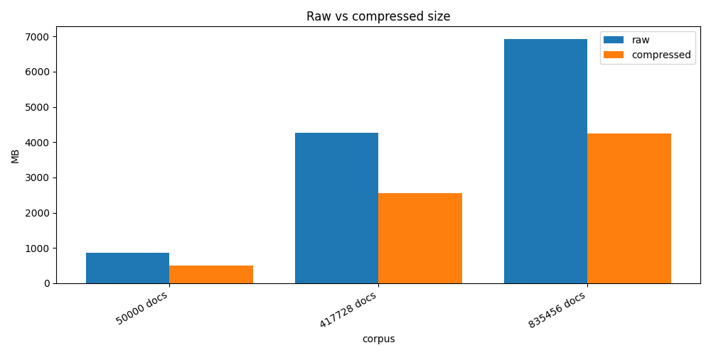
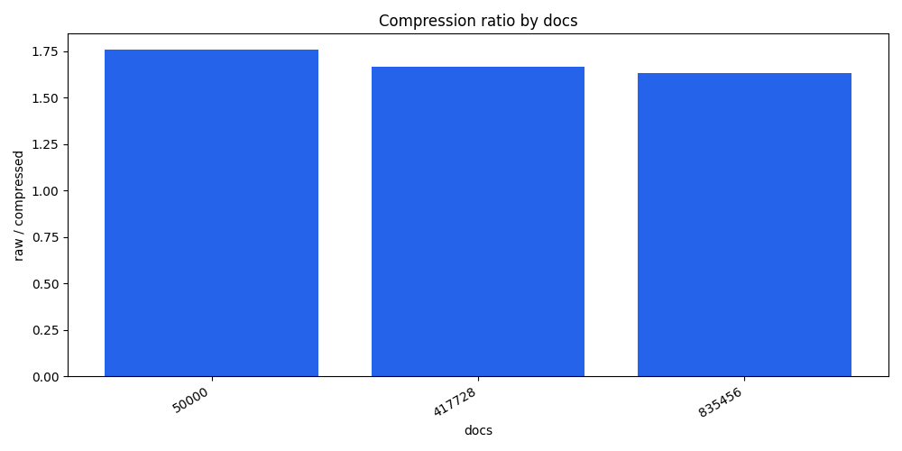
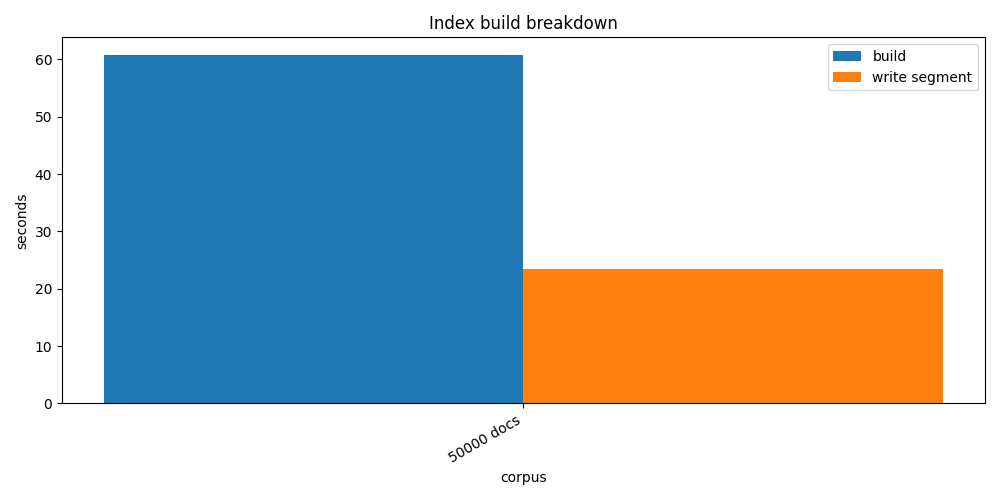
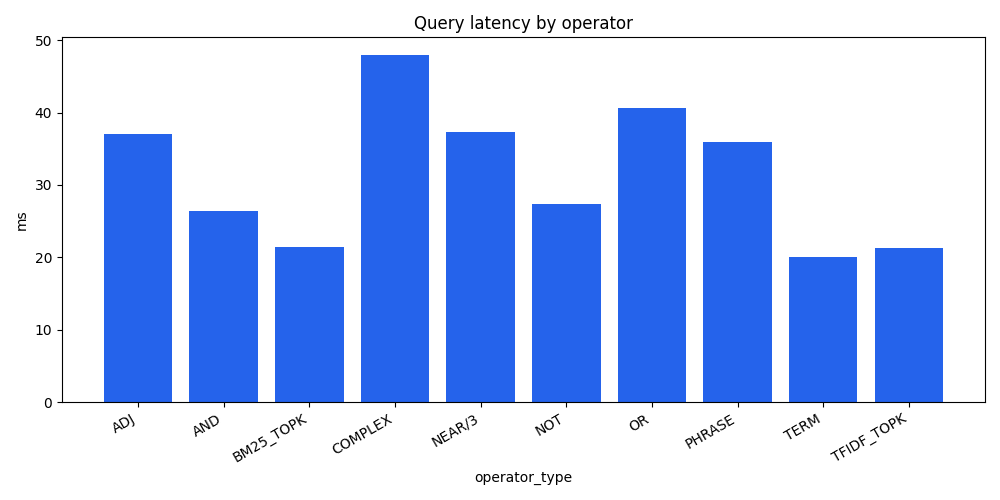
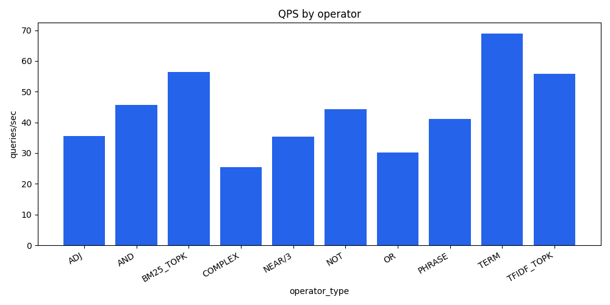
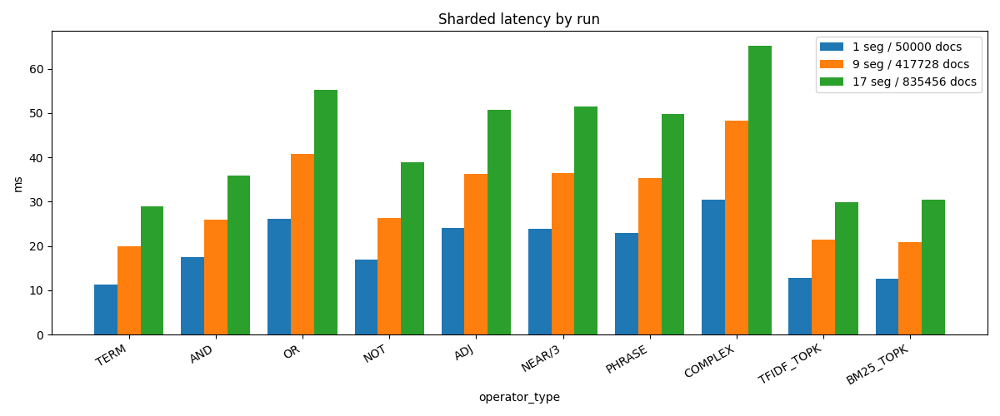
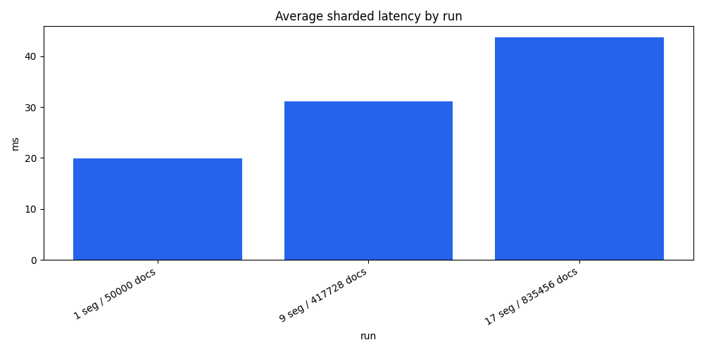
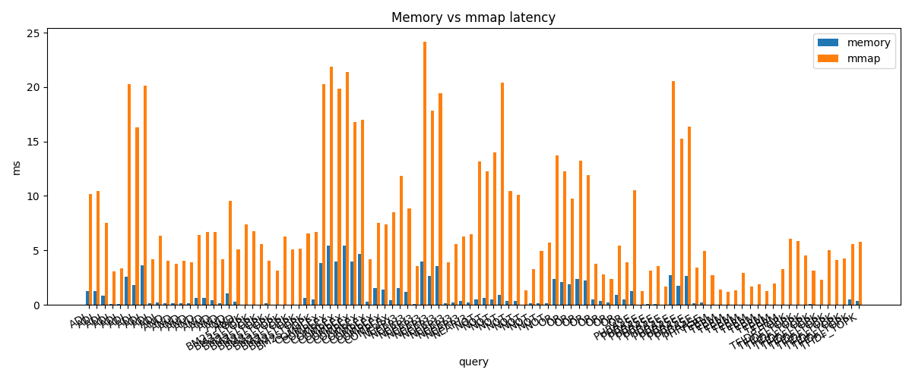
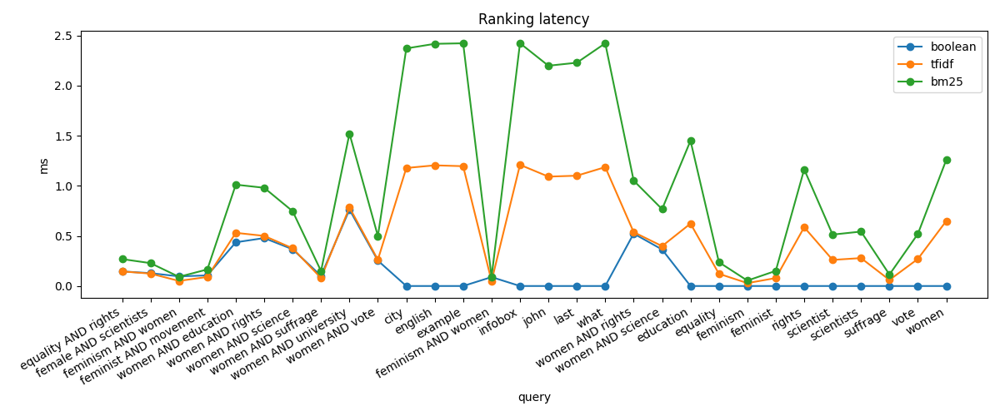
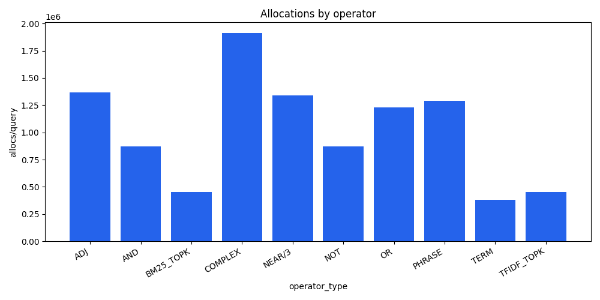

# HW5 - Позиционный Inverted Index

Выполнила Дусаева Элина.

## Общая идея решения

В этой лабораторной работе я реализовала свой обратный индекс для текстового поиска.

Основная идея такая:

- текст разбивается на токены;
- для каждого терма строится posting list;
- в posting хранится `docId`, частота терма в документе и позиции;
- boolean-запросы выполняются через итераторы по posting list-ам;
- позиционные запросы `ADJ` и `NEAR/k` дополнительно проверяют positions;
- индекс можно записать на диск в бинарный segment и потом открыть через `mmap`;
- posting list-ы сжимаются через delta-encoding, PForDelta и bitpacking;
- поверх boolean-результата считается ранжирование через TF-IDF или BM25.

## Как устроено решение

Основная логика лежит в `hw5/internal`.

| пакет | что делает |
| --- | --- |
| `analyzer` | приводит текст к lower-case, режет его на токены и сохраняет позиции |
| `index` | строит `MemoryIndex`, posting list-ы, df/ttf, skip pointers |
| `query` | парсит запрос и выполняет `AND/OR/NOT/ADJ/NEAR` |
| `scoring` | считает TF-IDF, BM25 и topK |
| `codec` | сжимает числа через delta, bitpacking и PForDelta |
| `storage` | пишет `.seg` файл и открывает его через mmap |
| `benchdata` | wiki JSONL reader, thematic query suite, synthetic smoke corpus |
| `benchmark` | собирает метрики и пишет CSV |

При построении индекса каждый документ сначала токенизируется. Потом для каждого токена сохраняется позиция внутри документа. После добавления всех документов builder сортирует posting list-ы по `docId`, считает `df`, `ttf`, длины документов и среднюю длину документа.

### Поисковой индекс - segment на диске

Для маленьких и средних прогонов индекс можно сохранить в один `.seg` файл. Сегмент устроен так:

1. `Header` - magic, version, codec, количество документов, количество терминов и offset-ы секций.
2. `Dictionary` - для каждого терма хранится `df`, `ttf`, offset и длина posting list-а.
3. `Postings` - сжатые docId gaps, freqs, positions и skip metadata.
4. `Doc norms` - длины документов.
5. `Titles` - заголовки документов для вывода результата.

`MmapSegmentReader` открывает файл через `mmap`. В память сразу читаются header, dictionary, doc norms и titles, а сами posting list-ы декодируются лениво только для терминов, которые реально встретились в запросе.

Для больших срезов Wikipedia добавлен sharded-режим: корпус делится на несколько segment-ов по `50000` документов, а рядом пишется `manifest.json` со списком `shard-*.seg`. В benchmark-е запрос запускается по выбранным shard-ам параллельно, а потом результаты объединяются.

### Документальная база в wiki_sample.jsonl

segment хранит только поисковые структуры, а документальная база остается в `wiki_sample.jsonl`. Для полноценного поисковика рядом можно было бы добавить отдельный doc store для текста, url и snippets.

### Raw vs compressed

Raw baseline я считаю как несжатое хранение `docId`, `freq` и всех `positions` по `uint32`. В segment-е вместо абсолютных значений записываются gaps: разности между соседними `docId` и позициями внутри документа. Эти gaps маленькие, поэтому они хорошо сжимаются через delta-encoding, PForDelta блоками по `128` значений и bitpacking; VarInt используется только для metadata и частот.

Детальный разбор я оставляю на одном базовом segment-е `50000` документов. Для масштабного сравнения дальше использую три одинаково определённых среза: `50000`, точную половину `417728` и весь текущий датасет `835456`. Для половины собран отдельный prefix-индекс `9` shard-ов, потому что просто открыть первые `9` shard-ов полного прогона было бы некорректно: это уже `450000` документов.

Более детально на одном segment-е `50000` документов:

| компонент | метод | raw MB | сжато MB | коэффициент |
| --- | --- | ---: | ---: | ---: |
| docIds | delta + PForDelta | 166.20 | 49.75 | 3.34x |
| freqs | VarInt | 166.20 | 41.63 | 3.99x |
| positions | delta + PForDelta | 534.85 | 353.83 | 1.51x |
| итого postings |  | 867.25 | 445.20 | 1.95x |
| итого segment | + dictionary, skips, doc norms, titles | 867.25 | 493.68 | 1.76x |

| corpus | docs | raw postings MB | compressed structures MB | segment file MB | compression ratio | saving |
| --- | ---: | ---: | ---: | ---: | ---: | ---: |
| wiki | 50000 | 867.25 | 493.68 | 562.78 | 1.7567 | 43.07% |
| wiki | 417728 | 4261.20 | 2554.48 | 2893.23 | 1.6681 | 40.05% |
| wiki | 835456 | 6933.65 | 4251.42 | 4803.48 | 1.6309 | 38.68% |



<!--  -->

На базовом segment-е сжатие уменьшило raw postings на `43.07%`. На больших срезах коэффициент чуть падает - чем больше корпус, тем сильнее растёт доля positions, а именно они сжимаются слабее `docIds` и `freqs`.

## Query processing

Для ручной проверки каждого оператора удобно запускать один запрос на базовом `50k` segment-е:

```bash
make search QUERY='women AND science' INDEX=./data/wiki_50k.seg TOPK=10
make explain QUERY='women NEAR/3 rights' INDEX=./data/wiki_50k.seg
```

Примеры операторов и ожидаемая семантика:

- `TERM`: `women` возвращает все документы, где встречается терм `women`.
- `AND`: `women AND science` сначала сортирует children по estimated cost (`df`), а потом пересекает posting list-ы через iterator + `Advance`.
- `OR`: `women OR feminism` объединяет результаты через min-heap по текущему `docId`, без полной пересортировки всего вывода.
- `NOT`: `women AND NOT men` поддерживается только вместе с положительной частью. Самостоятельный `NOT men` не выполняется, потому что потребовал бы обходить весь universe документов.
- `ADJ`: `feminist ADJ movement` требует, чтобы токены шли строго подряд. Сначала делается пересечение по `docId`, потом проверяются соседние позиции.
- `NEAR/3`: `women NEAR/3 rights` тоже сначала пересекает документы, а затем проверяет, что расстояние между позициями не больше `3`.
- `PHRASE`: `"marie curie"` в текущей реализации эквивалентен цепочке adjacency-проверок по всем токенам фразы.
- `COMPLEX`: `(women OR feminism) AND rights` строится рекурсивно из тех же boolean и positional iterator-ов.
- `TFIDF_TOPK` и `BM25_TOPK`: после boolean-фильтрации кандидаты ранжируются, например для `women AND science` с `--rank tfidf` или `--rank bm25`.

## Набор запросов для benchmark (500 запросов по 50 на каждый тип опреатора)

Изначально query suite получался плохим, потому что самые частотные термы Wikipedia - это `the`, `of`, `and`, `to`. Поэтому я решила сделать тематическую основу для набора запросов посвященную женщинам, науке, с добавлением ограничений, чтобы набор был воспроизводимым и не состоял из стоп-слов.

Набор формируется так:

- стоп-слова не используются как основные термы
- сначала пробуются тематические запросы про женщин, феминизм, права, образование и науку
- термы берутся из средней частоты, а не из самого верха словаря
- для `ADJ`, `NEAR/3` и phrase берутся пары, реально встречающиеся рядом в Wikipedia
- для быстрого прогона можно брать по 10 запросов на тип, для финального benchmark-а берется по `50` на тип
- все запросы дают ненулевой результат

Примеры запросов:

```text
women AND science
women NEAR/3 rights
(women OR feminism) AND rights
female AND scientists
feminist ADJ movement
"marie curie"
"ada lovelace"
"voting rights"
```

## На чем тестировалось

### Synthetic smoke

Synthetic corpus оставлен только как быстрый smoke, а не как основной исследовательский корпус: в нем генерируются небольшие наборы на `1000/5000/10000` документов, документы имеют длину примерно `100-300` токенов, словарь около `10000` терминов, есть high-frequency/low-frequency слова и контролируемые фразы вроде `data pipeline`, `new york`, `machine learning`, `distributed systems`. Он нужен, чтобы быстро проверять `ADJ` и `NEAR`, когда не хочется каждый раз читать большой wiki-файл; в основных таблицах ниже используется Wikipedia.

### Wikipedia

Основной benchmark сделан на Wikipedia JSONL:

```json
{"id":1,"title":"Article title","text":"Article text"}
```

Скачивание делалось из официального Wikimedia dump

Локальный файл сейчас занимает `6.1 GB` и содержит `835456` строк. Базовый segment строится на `50000` документов. Для финального сравнения поиска я использую три среза: `1` segment на `50000` документов, отдельный half-prefix на `417728` документов в `9` segment-ах и весь датасет `835456` документов в `17` segment-ах.

Характеристики корпуса:

| docs | shards | total tokens | avg doc len | min doc len | max doc len | total postings |
| ---: | ---: | ---: | ---: | ---: | ---: | ---: |
| 50000 | 1 | 133.71M | 2674.23 | 24 | 44515 | 41.55M |
| 417728 | 9 | 630.39M | 1509.09 | 20 | 69070 | 217.46M |
| 835456 | 17 | 1008.71M | 1207.37 | 20 | 69070 | 362.35M |

Точное число `unique terms` я отдельно фиксировала для базового `50000`-среза: `1.15M`. Для сравнительной таблицы выше важнее были суммарные document-level характеристики и масштаб postings.

## Конфигурация замеров

- ОС: `Ubuntu 24.04`
- CPU: `13th Gen Intel(R) Core(TM) i5-13400F`
- Ядер: `10`
- Потоков: `16`

На уровне приложения параллелизм используется только в `sharded`-режиме запросов: на каждый открытый shard поднимается отдельная goroutine, а затем результаты синхронизируются через `WaitGroup`.

- для `50000 docs` использовался `1` shard и фактически `1` worker;
- для `417728 docs` использовалось `9` shard-ов и `9` worker goroutine на запрос;
- для `835456 docs` использовалось `17` shard-ов и `17` worker goroutine на запрос.

Построение одного segment-а, `wiki-stats`, `compression-stats`, single-segment `mmap` и `memory` benchmark идут без явного распараллеливания в коде приложения.

Для query benchmark используется один дополнительный прогревочный запуск, который не попадает в среднее, после чего считается среднее по `5` измерениям. Тестируем на `500` запросах по `50` на каждый тип оператора, читаем сегменты через `mmap`, чтобы не нагружать диск. Для всех метрик, где есть повторные прогоны, дополнительно считается `95% confidence interval` для среднего; при `n=5` используется t-критическое `2.776`.

## Построение индекса

| docs | unique terms | total postings | build time s | segment write s | total time s | segment size MB |
| ---: | ---: | ---: | ---: | ---: | ---: | ---: |
| 50000 | 1.15M | 41.55M | 61.97 | 23.84 | 85.81 | 562.78 |

На `50000` документах построение занимает в среднем `85.81s`, из них `23.84s` уходит на запись сжатого segment-а. В `wiki_build_stats.csv` теперь дополнительно сохраняется `95% CI` для `build`, `write` и `total time`. Это нормально для текущей реализации, потому что во время записи заново кодируются `docId` gaps и positions. 



## Задержка запросов

| corpus | docs | segments | index size MB | queries | iterations | avg latency ms |
| --- | ---: | ---: | ---: | ---: | ---: | ---: |
| wiki shards | 50000 | 1 | 562.78 | 500 | 5 | 20.162 |
| wiki shards | 417728 | 9 | 2893.23 | 500 | 5 | 31.407 |
| wiki shards | 835456 | 17 | 4803.48 | 500 | 5 | 45.519 |

Средняя задержка по операторам:

| operator | 1 seg / 50000 docs | 9 seg / 417728 docs | 17 seg / 835456 docs |
| --- | ---: | ---: | ---: |
| TERM | 11.519 | 19.151 | 31.826 |
| AND | 17.603 | 25.497 | 36.826 |
| OR | 26.701 | 39.357 | 56.994 |
| NOT | 17.583 | 31.035 | 39.536 |
| ADJ | 23.978 | 36.526 | 56.489 |
| NEAR/3 | 24.355 | 37.222 | 53.605 |
| PHRASE | 23.274 | 35.827 | 50.783 |
| COMPLEX | 31.171 | 47.185 | 65.737 |
| TFIDF_TOPK | 12.833 | 21.636 | 31.714 |
| BM25_TOPK | 12.609 | 20.635 | 31.682 |









Самые дешевые запросы — одиночный term и topK-запросы на уже отобранных кандидатах. `ADJ`, `NEAR/3`, phrase, `OR` и сложные запросы дороже, потому что им нужно декодировать больше posting list-ов, проверять positions или объединять большие множества документов. При росте корпуса с `50000` до `835456` документов средняя latency выросла с `20.16 ms` до `45.52 ms`, то есть не линейно по числу документов: sharding позволяет читать только нужные posting list-ы и параллельно обходить segment-ы. Для каждого запроса в CSV теперь также сохраняются `avg_latency_ci_low_ms` и `avg_latency_ci_high_ms`, а для throughput — `qps_ci_low` и `qps_ci_high`.

## Memory index vs mmap segment

Для проверки я сравнила результаты на одних и тех же 100 запросах.

В предварительном single-segment прогоне на `DOCS=10000` все результаты совпали:

```text
results_equal = true для 100/100 запросов
```

На `DOCS=25000` совпало `96/100` запросов. Все 4 расхождения относятся к `NEAR/3` по частотному терму `women`, то есть к самой чувствительной части с positions. Boolean, phrase, ranking-запросы и остальные proximity-запросы совпали. Финальные большие прогоны выполняются в sharded-режиме: один segment `50000`, первые `9` segment-ов и весь датасет.

Важно: memory index уже держит все posting list-ы в памяти, а mmap backend каждый раз лениво декодирует нужные posting list-ы из segment-а. Поэтому mmap ожидаемо медленнее, зато не требует держать весь postings section как готовые Go-структуры.

В `wiki_mmap_vs_memory.csv` дополнительно сохраняются `95% CI` для `memory_latency_ms` и `mmap_latency_ms`.

Примеры на `DOCS=25000`:

| query | memory ms | mmap ms | hits | equal |
| --- | ---: | ---: | ---: | --- |
| `women AND science` | 0.4532 | 6.7136 | 1704 | true |
| `women NEAR/3 rights` | 0.3418 | 6.2512 | 391/393 | false |
| `(women OR feminism) AND rights` | 1.4236 | 7.3700 | 2257 | true |
| `"ada lovelace"` | 0.0138 | 1.2748 | 31 | true |
| `"marie curie"` | 0.0294 | 1.6640 | 56 | true |



## Ранжирование

Для ранжирования я сравнила отдельные `TFIDF_TOPK` и `BM25_TOPK` запросы из того же sharded benchmark. TopK считается через min-heap, а не через сортировку всех результатов.

В `wiki_ranking_stats.csv` теперь для `boolean`, `TF-IDF` и `BM25` также сохраняются `95% CI` по времени.

Средние значения по `50` запросам каждого типа:

| mode | 1 seg / 50000 docs | 9 seg / 417728 docs | 17 seg / 835456 docs |
| --- | ---: | ---: | ---: |
| TF-IDF topK | 12.732 | 21.347 | 29.920 |
| BM25 topK | 12.642 | 20.924 | 30.513 |

На этом наборе TF-IDF и BM25 получились близкими по времени: основная стоимость сидит не в формуле score, а в чтении posting list-ов и подготовке кандидатов.

На тематических запросах в top-результатах появляются ожидаемые статьи: `A Vindication of the Rights of Woman`, `Ada Lovelace`, `Dava Sobel`, `Egalitarianism`, `Dianic Wicca`.



## Память и аллокации

Для query benchmark сохраняются `alloc_bytes_per_query` и `allocs_per_query`. По графику видно, что позиционные операции и сложные запросы создают больше временных структур, потому что им нужно декодировать positions и проверять расстояния между позициями.



## Профилирование

CPU и memory profile я снимаю на базовом `50000`-срезе: для frame graph этого достаточно, а Web UI через `pprof` открывается заметно быстрее, чем на полном sharded-прогоне.

Скрипты:

```bash
../scripts/hw5_profile_cpu.sh
../scripts/hw5_profile_mem.sh
```

Они сохраняют:

```text
reports/hw5/profiles/cpu_and.out
reports/hw5/profiles/cpu_or.out
reports/hw5/profiles/cpu_near.out
reports/hw5/profiles/cpu_bm25.out
reports/hw5/profiles/mem_query.out
```

Открывать их удобнее сразу в Web UI:

```bash
go tool pprof -http=:8080 reports/hw5/profiles/cpu_and.out
```

Дальше уже из браузера можно снять нужные скриншоты flame graph / graph view и вставить их в отчёт.

Ожидаемые bottleneck-и:

- tokenizer и построение map-ов на этапе build;
- PForDelta encode/decode;
- декодирование positions;
- проверка positions для `ADJ` и `NEAR`;
- BM25 scoring;
- heap merge для `OR`.

## Где была сложность

Самая неприятная часть здесь — не сам `AND`, а сочетание трех вещей:

1. нужно сохранить positions, иначе `ADJ` и `NEAR` невозможны;
2. positions резко увеличивают размер postings;
3. после сжатия нужно уметь читать только нужный term из mmap segment-а.

Из-за этого пришлось отдельно считать offsets в dictionary, отдельно кодировать docIds/freqs/positions и отдельно проверять, что memory и mmap дают одинаковые docId.

Еще одна проблема была в benchmark-наборе. Если брать самые частотные слова Wikipedia, запросы становятся слишком шумными. Поэтому query suite теперь фильтрует стоп-слова и выбирает более нормальные термы средней частоты.

## Валидация корректности

Покрыто тестами:

- tokenizer;
- delta encode/decode;
- bitpack encode/decode;
- PForDelta encode/decode;
- index builder;
- `AND`;
- `OR`;
- `NOT`;
- `ADJ`;
- `NEAR/k`;
- TF-IDF;
- BM25;
- segment write/read;
- mmap lookup;
- query parser.

Проверка:

```bash
go test ./...
```

Большие wiki benchmark-и не запускаются в обычном `go test`, потому что требуют локальный `wiki_sample.jsonl`.

## Что еще можно улучшить

- добавить нормальный stop-word/stemming analyzer;
- кешировать декодированные posting list-ы для mmap backend;
- хранить skip offsets прямо внутрь compressed stream;
- ограничить число worker-ов для parallel search по shard-ам, чтобы на очень большом числе segment-ов не создавать лишние goroutine;
- добавить snippets;
- отдельно сравнить холодный mmap и теплый mmap;
- разобраться с 4 расхождениями `NEAR/3` на `DOCS=25000`;
- добавить regression-test, который сравнивает memory и mmap для proximity-запросов на большом корпусе.

## Выводы

Получился рабочий позиционный inverted index: он строит координатные posting list-ы, поддерживает boolean и proximity-запросы, сохраняет индекс на диск, открывает его через mmap и сжимает postings.

На базовом segment-е `50000` документов сжатие уменьшило raw postings на `43.07%`: postings сжались с `867.25 MB` до `445.20 MB`, а весь segment с учетом dictionary, skips, doc norms и titles занимает `562.78 MB` на диске. Самые быстрые запросы — одиночный term и topK. Позиционные запросы дороже, потому что после пересечения документов нужно проверять positions.

В single-segment sanity-check на `DOCS=10000` memory и mmap совпали для `100/100` запросов. На `DOCS=25000` совпало `96/100`; оставшиеся расхождения локализованы в `NEAR/3`, поэтому это главный следующий пункт для доработки. Для больших размеров используется sharded benchmark: `1`, `9` и `17` segment-ов. На полном Wikipedia-срезе `835456` документов средняя latency по `500` запросам получилась `43.67 ms`.

Synthetic я оставляю только для smoke-проверок. Основной корпус для отчета — Wikipedia `6.1 GB` и тематические запросы про женщин, права, образование, феминизм и науку.
