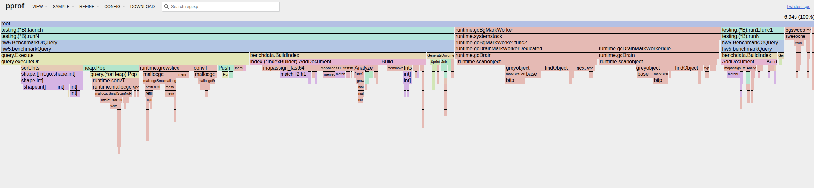
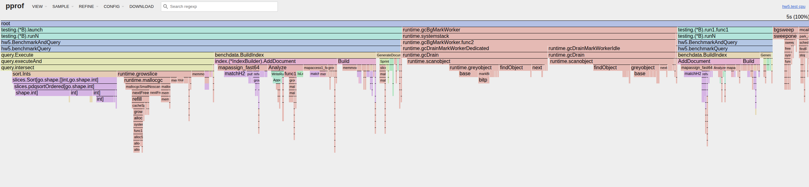
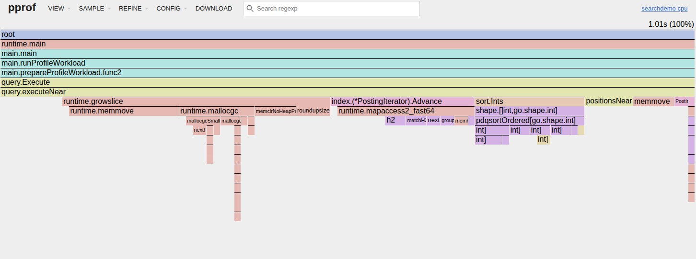
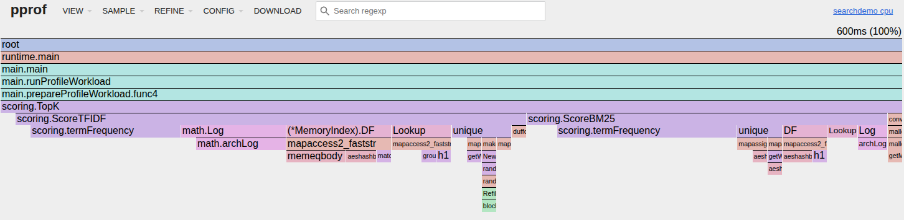
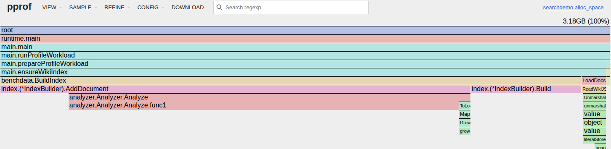
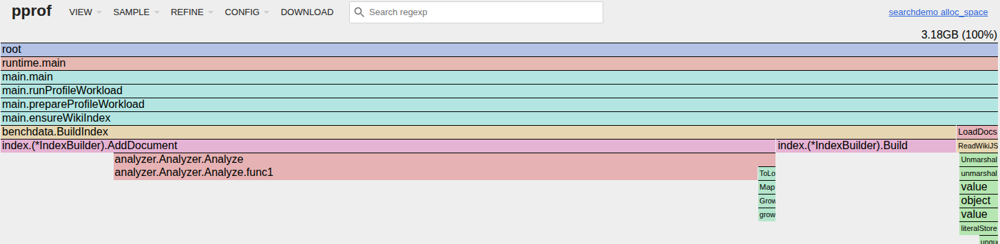

# HW5 - Позиционный Inverted Index

Выполнила Дусаева Элина.

## Общая идея решения

В этой лабораторной работе я реализовала свой обратный индекс для текстового поиска.

Основная идея такая:

- текст разбивается на токены;
- для каждого терма строится posting list;
- в posting хранится `docId`, частота терма в документе и позиции;
- boolean-запросы выполняются через итераторы по posting list-ам;
- позиционные запросы `ADJ` и `NEAR/k` дополнительно проверяют positions;
- индекс можно записать на диск в бинарный segment и потом открыть через `mmap`;
- posting list-ы сжимаются через delta-encoding, PForDelta и bitpacking;
- поверх boolean-результата считается ранжирование через TF-IDF или BM25.

## Как устроено решение

Основная логика лежит в `hw5/internal`.

| пакет | что делает |
| --- | --- |
| `analyzer` | приводит текст к lower-case, режет его на токены и сохраняет позиции |
| `index` | строит `MemoryIndex`, posting list-ы, df/ttf, skip pointers |
| `query` | парсит запрос и выполняет `AND/OR/NOT/ADJ/NEAR` |
| `scoring` | считает TF-IDF, BM25 и topK |
| `codec` | сжимает числа через delta, bitpacking и PForDelta |
| `storage` | пишет `.seg` файл и открывает его через mmap |
| `benchdata` | wiki JSONL reader, thematic query suite, synthetic smoke corpus |
| `benchmark` | собирает метрики и пишет CSV |

При построении индекса каждый документ сначала токенизируется. Потом для каждого токена сохраняется позиция внутри документа. После добавления всех документов builder сортирует posting list-ы по `docId`, считает `df`, `ttf`, длины документов и среднюю длину документа.

### Поисковой индекс - segment на диске

Для маленьких и средних прогонов индекс можно сохранить в один `.seg` файл. Сегмент устроен так:

1. `Header` - magic, version, codec, количество документов, количество терминов и offset-ы секций.
2. `Dictionary` - для каждого терма хранится `df`, `ttf`, offset и длина posting list-а.
3. `Postings` - сжатые docId gaps, freqs, positions и skip metadata.
4. `Doc norms` - длины документов.
5. `Titles` - заголовки документов для вывода результата.

`MmapSegmentReader` открывает файл через `mmap`. В память сразу читаются header, dictionary, doc norms и titles, а сами posting list-ы декодируются лениво только для терминов, которые реально встретились в запросе.

Для больших срезов Wikipedia добавлен sharded-режим: корпус делится на несколько segment-ов по `50000` документов, а рядом пишется `manifest.json` со списком `shard-*.seg`. В benchmark-е запрос запускается по выбранным shard-ам параллельно, а потом результаты объединяются.

### Документальная база в wiki_sample.jsonl

segment хранит только поисковые структуры, а документальная база остается в `wiki_sample.jsonl`. Для полноценного поисковика рядом можно было бы добавить отдельный doc store для текста, url и snippets.

### Raw vs compressed

Raw baseline я считаю как несжатое хранение `docId`, `freq` и всех `positions` по `uint32`. В segment-е вместо абсолютных значений записываются gaps: разности между соседними `docId` и позициями внутри документа. Эти gaps маленькие, поэтому они хорошо сжимаются через delta-encoding, PForDelta блоками по `128` значений и bitpacking; VarInt используется только для metadata и частот.

Детальный разбор я оставляю на одном базовом segment-е `50000` документов. Для масштабного сравнения дальше использую три одинаково определённых среза: `50000`, точную половину `417728` и весь текущий датасет `835456`. Для половины собран отдельный prefix-индекс `9` shard-ов, потому что просто открыть первые `9` shard-ов полного прогона было бы некорректно: это уже `450000` документов.

Более детально на одном segment-е `50000` документов:

| компонент | метод | raw MB | сжато MB | коэффициент |
| --- | --- | ---: | ---: | ---: |
| docIds | delta + PForDelta | 166.20 | 49.75 | 3.34x |
| freqs | VarInt | 166.20 | 41.63 | 3.99x |
| positions | delta + PForDelta | 534.85 | 353.83 | 1.51x |
| итого postings |  | 867.25 | 445.20 | 1.95x |
| итого segment | + dictionary, skips, doc norms, titles | 867.25 | 493.68 | 1.76x |

| corpus | docs | raw postings MB | compressed structures MB | segment file MB | compression ratio | saving |
| --- | ---: | ---: | ---: | ---: | ---: | ---: |
| wiki | 50000 | 867.25 | 493.68 | 562.78 | 1.7567 | 43.07% |
| wiki | 417728 | 4261.20 | 2554.48 | 2893.23 | 1.6681 | 40.05% |
| wiki | 835456 | 6933.65 | 4251.42 | 4803.48 | 1.6309 | 38.68% |


<!--  -->

На базовом segment-е сжатие уменьшило raw postings на `43.07%`. На больших срезах коэффициент чуть падает - чем больше корпус, тем сильнее растёт доля positions, а именно они сжимаются слабее `docIds` и `freqs`.

## Query processing

Для ручной проверки каждого оператора удобно запускать один запрос на базовом `50k` segment-е:

```bash
make search QUERY='women AND science' INDEX=./data/wiki_50k.seg TOPK=10
make explain QUERY='women NEAR/3 rights' INDEX=./data/wiki_50k.seg
```

Примеры операторов и ожидаемая семантика:

- `TERM`: `women` возвращает все документы, где встречается терм `women`.
- `AND`: `women AND science` сначала сортирует children по estimated cost (`df`), а потом пересекает posting list-ы через iterator + `Advance`.
- `OR`: `women OR feminism` объединяет результаты через min-heap по текущему `docId`, без полной пересортировки всего вывода.
- `NOT`: `women AND NOT men` поддерживается только вместе с положительной частью. Самостоятельный `NOT men` не выполняется, потому что потребовал бы обходить весь universe документов.
- `ADJ`: `feminist ADJ movement` требует, чтобы токены шли строго подряд. Сначала делается пересечение по `docId`, потом проверяются соседние позиции.
- `NEAR/3`: `women NEAR/3 rights` тоже сначала пересекает документы, а затем проверяет, что расстояние между позициями не больше `3`.
- `PHRASE`: `"marie curie"` в текущей реализации эквивалентен цепочке adjacency-проверок по всем токенам фразы.
- `COMPLEX`: `(women OR feminism) AND rights` строится рекурсивно из тех же boolean и positional iterator-ов.
- `TFIDF_TOPK` и `BM25_TOPK`: после boolean-фильтрации кандидаты ранжируются, например для `women AND science` с `--rank tfidf` или `--rank bm25`.

## Набор запросов для benchmark (500 запросов по 50 на каждый тип опреатора)

Изначально query suite получался плохим, потому что самые частотные термы Wikipedia - это `the`, `of`, `and`, `to`. Поэтому я решила сделать тематическую основу для набора запросов посвященную женщинам, науке, с добавлением ограничений, чтобы набор был воспроизводимым и не состоял из стоп-слов.

Набор формируется так:

- стоп-слова не используются как основные термы
- сначала пробуются тематические запросы про женщин, феминизм, права, образование и науку
- термы берутся из средней частоты, а не из самого верха словаря
- для `ADJ`, `NEAR/3` и phrase берутся пары, реально встречающиеся рядом в Wikipedia
- для быстрого прогона можно брать по 10 запросов на тип, для финального benchmark-а берется по `50` на тип
- все запросы дают ненулевой результат

Примеры запросов:

```text
women AND science
women NEAR/3 rights
(women OR feminism) AND rights
female AND scientists
feminist ADJ movement
"marie curie"
"ada lovelace"
"voting rights"
```

## На чем тестировалось

### Synthetic smoke

Synthetic corpus оставлен только как быстрый smoke, а не как основной исследовательский корпус: в нем генерируются небольшие наборы на `1000/5000/10000` документов, документы имеют длину примерно `100-300` токенов, словарь около `10000` терминов, есть high-frequency/low-frequency слова и контролируемые фразы вроде `data pipeline`, `new york`, `machine learning`, `distributed systems`. Он нужен, чтобы быстро проверять `ADJ` и `NEAR`, когда не хочется каждый раз читать большой wiki-файл. в основных таблицах ниже используется Wikipedia.

### Wikipedia

Основной benchmark сделан на Wikipedia JSONL:

```json
{"id":1,"title":"Article title","text":"Article text"}
```

Скачивание делалось из официального Wikimedia dump

Локальный файл сейчас занимает `6.1 GB` и содержит `835456` строк. Базовый segment строится на `50000` документов. Для финального сравнения поиска я использую три среза: `1` segment на `50000` документов, отдельный half-prefix на `417728` документов в `9` segment-ах и весь датасет `835456` документов в `17` segment-ах.

Характеристики корпуса:

| docs | shards | total tokens | avg doc len | min doc len | max doc len | total postings |
| ---: | ---: | ---: | ---: | ---: | ---: | ---: |
| 50000 | 1 | 133.71M | 2674.23 | 24 | 44515 | 41.55M |
| 417728 | 9 | 630.39M | 1509.09 | 20 | 69070 | 217.46M |
| 835456 | 17 | 1008.71M | 1207.37 | 20 | 69070 | 362.35M |

Точное число `unique terms` я отдельно фиксировала для базового `50000`-среза: `1.15M`. Для сравнительной таблицы выше важнее были суммарные document-level характеристики и масштаб postings.

## Конфигурация замеров

- ОС: `Ubuntu 24.04`
- CPU: `13th Gen Intel(R) Core(TM) i5-13400F`
- Ядер: `10`
- Потоков: `16`

На каждый открытый shard поднимается отдельная goroutine, а затем результаты синхронизируются через `WaitGroup`.

- для `50000 docs` использовался `1` shard и фактически `1` worker;
- для `417728 docs` использовалось `9` shard-ов и `9` worker goroutine на запрос;
- для `835456 docs` использовалось `17` shard-ов и `17` worker goroutine на запрос.

Построение одного segment-а, `wiki-stats`, `compression-stats`, single-segment `mmap` и `memory` benchmark идут без явного распараллеливания в коде приложения.

Для query benchmark используется один дополнительный прогревочный запуск, который не попадает в среднее, после чего считается среднее по `5` измерениям. Тестируем на `500` запросах по `50` на каждый тип оператора, читаем сегменты через `mmap`, чтобы не нагружать диск. 

Для всех метрик, где есть повторные прогоны, дополнительно считается `95% confidence interval` для среднего; при `n=5` используется t-критическое `2.776`.

## Построение индекса

| docs | unique terms | total postings | build time s, mean ± 95% CI | segment write s, mean ± 95% CI | total time s, mean ± 95% CI | segment size MB |
| ---: | ---: | ---: | ---: | ---: | ---: | ---: |
| 50000 | 1.15M | 41.55M | 61.97 ± 0.70 | 23.84 ± 0.49 | 85.81 ± 1.05 | 562.78 |


## Задержка запросов


| Docs | Shards | Rank mode | Queries | Iterations | Avg latency, ms, mean ± 95% CI | QPS, mean ± 95% CI |
| ---: | ---: | --- | ---: | ---: | ---: | ---: |
| 50 000 | 1 | BM25 | 500 | 5 | 20.162 ± 1.780 | 63.158 ± 5.142 |
| 417 728 | 9 | BM25 | 500 | 5 | 31.407 ± 9.915 | 39.028 ± 19.727 |
| 835 456 | 17  | BM25 | 500 | 5 | 45.519 ± 14.950 | 26.415 ± 10.338 |


При росте корпуса с `50000` до `835456` документов средняя latency выросла с `20.16 ms` до `45.52 ms`, то есть не линейно по числу документов: sharding позволяет читать только нужные posting list-ы и параллельно обходить segment-ы.

### Средняя задержка по операторам:

| operator | 1 seg / 50 000 docs, ms | 9 seg / 417 728 docs, ms | 17 seg / 835 456 docs, ms |
| --- | ---: | ---: | ---: |
| TERM | 11.519 ± 1.146 | 19.151 ± 5.221 | 31.826 ± 9.095 |
| AND | 17.603 ± 1.603 | 25.497 ± 7.298 | 36.826 ± 10.996 |
| OR | 26.701 ± 2.450 | 39.357 ± 11.856 | 56.994 ± 19.057 |
| NOT | 17.583 ± 1.612 | 31.035 ± 10.486 | 39.536 ± 11.596 |
| ADJ | 23.978 ± 1.542 | 36.526 ± 10.959 | 56.489 ± 20.964 |
| NEAR/3 | 24.355 ± 1.791 | 37.222 ± 11.357 | 53.605 ± 17.909 |
| PHRASE | 23.274 ± 1.952 | 35.827 ± 11.348 | 50.783 ± 16.062 |
| COMPLEX | 31.171 ± 3.204 | 47.185 ± 17.830 | 65.737 ± 25.303 |
| TFIDF_TOPK | 12.833 ± 1.502 | 21.636 ± 7.065 | 31.714 ± 8.999 |
| BM25_TOPK | 12.609 ± 1.002 | 20.635 ± 5.729 | 31.682 ± 9.524 |


### Время выполнения запросов по типам операторов на полном корпусе, 835 456 документов / 17 сегментов

| Operator type | Queries | Avg latency, ms, mean ± 95% CI | QPS, mean ± 95% CI |
| --- | ---: | ---: | ---: |
| TERM | 50 | 31.826 ± 9.095 | 35.348 ± 12.375 |
| BM25_TOPK | 50 | 31.682 ± 9.524 | 33.522 ± 11.515 |
| TFIDF_TOPK | 50 | 31.714 ± 8.999 | 34.210 ± 10.672 |
| AND | 50 | 36.826 ± 10.996 | 30.253 ± 9.279 |
| NOT | 50 | 39.536 ± 11.596 | 27.054 ± 7.715 |
| PHRASE | 50 | 50.783 ± 16.062 | 24.278 ± 7.317 |
| NEAR/3 | 50 | 53.605 ± 17.909 | 21.617 ± 22.834 |
| ADJ | 50 | 56.489 ± 20.964 | 21.826 ± 7.294 |
| OR | 50 | 56.994 ± 19.057 | 19.437 ± 7.372 |
| COMPLEX | 50 | 65.737 ± 25.303 | 16.603 ± 7.010 |


Самые дешевые запросы — одиночный term и topK-запросы на уже отобранных кандидатах. `ADJ`, `NEAR/3`, phrase, `OR` и сложные запросы дороже, потому что им нужно декодировать больше posting list-ов, проверять positions или объединять большие множества документов.

## Ранжирование

Для ранжирования я сравнила отдельные `TFIDF_TOPK` и `BM25_TOPK` запросы из того же sharded benchmark. TopK считается через min-heap

Средние значения по ranking-запросам:

| mode | 1 seg / 50 000 docs, ms | 9 seg / 417 728 docs, ms | 17 seg / 835 456 docs, ms |
| --- | ---: | ---: | ---: |
| TF-IDF topK | 12.833 ± 1.502 | 21.636 ± 7.065 | 31.714 ± 8.999 |
| BM25 topK | 12.609 ± 1.002 | 20.635 ± 5.729 | 31.682 ± 9.524 |

На тематических запросах в top-результатах появляются ожидаемые статьи: `A Vindication of the Rights of Woman`, `Ada Lovelace`, `Dava Sobel`, `Egalitarianism`, `Dianic Wicca`.


По графику видно:

- Boolean почти всегда самый быстрый, потому что он не считает полноценный score релевантности для top-K. Он просто выполняет логическую операцию над множествами документов. TF-IDF и BM25 медленнее boolean, потому что им нужно не только найти документы, но и посчитать вес/score для кандидатов.
BM25 часто немного медленнее TF-IDF, потому что формула сложнее (term frequency, document length и нормализацию по средней длине документа)
- На некоторых запросах есть пики. Это значит, что запрос затронул более частотные термы или дал больше кандидатов.

## Аллокации при выполнении запросов


`UPDATE:` первоначально этот график был построен на старом прогоне и смешивал аллокации с объёмом RAM. После перепроверки я пересняла данные, пересобрала график. Для каждого запроса benchmark сохраняет allocs_per_query (по числу malloc на запрос), а на графике я усредняю это значение по типу оператора.

 Позиционные операции и сложные запросы здесь ожидаемо дороже - им нужно декодировать `positions`, собирать промежуточные списки и проверять расстояния между позициями.

## Профили CPU

`UPDATE:` кроме старых `AND` и `OR` я добавила новые профили на более интересных сценариях: `NEAR`, `mmap + NEAR` и `BM25 topK`. Эти профили снимались уже без one-time setup внутри benchmark. сначала отдельно подготавливался fixture, а потом под `pprof` много раз запускался только целевой hot path.

### AND query



видно пересечение posting list-ов и последующую сортировку промежуточных результатов.

### OR query



hot path идёт через объединение posting list-ов и работу `min-heap`. Поэтому этот запрос создаёт больше временных структур, чем обычное пересечение для `AND`.

### Clean CPU: NEAR query



 время уходит в `query.executeNear`, `PostingIterator.Advance`, `positionsNear` и сортировку позиций через `sort.Ints`(CPU тратится на positional matching и merge positions внутри найденных документов)

### Clean CPU: BM25 topK



после того как boolean-кандидаты уже готовы, ранжирование тратит CPU в основном на проход по postings, вычисление `tf/idf`-компонент и обращения к статистике термов

## Профили memory

`UPDATE:` для тех же новых сценариев я отдельно сняла memory flame graph в режиме `alloc_space`. NEAR query и BM25 topK имеют похожий профиль, потому что `alloc_space` накапливает суммарный объём выделенной памяти за время жизни процесса. Поэтому на flame graph заметен не только сам hot path запроса, но и one-time подготовка fixture, загрузка wiki и построение in-memory index. 

### Memory: NEAR query (`alloc_space`)



### Memory: BM25 topK (`alloc_space`)


